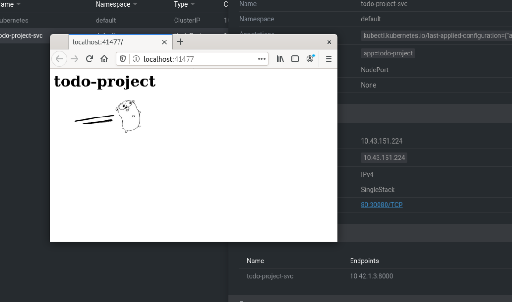
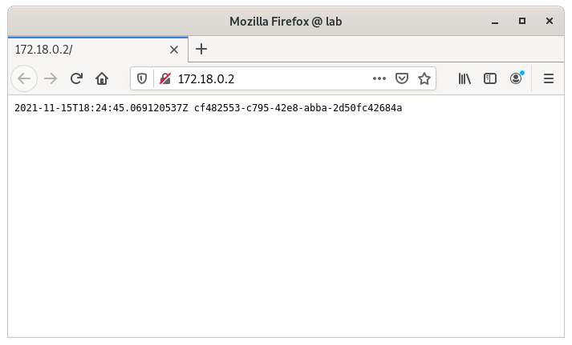
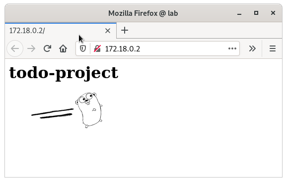

# Exercices

## 1.01

https://github.com/pasiol/log-output/tree/1.01

    docker build -t pasiol/log-output .
    docker push pasiol/log-output

    kubectl create deployment log-output --image=pasiol/log-output@sha256:173888d2d767bd8992d62364c02b186e849984ff8f09ed4c91d49d8a3a631294
    deployment.apps/log-output created
    kubectl get deployments
    NAME         READY   UP-TO-DATE   AVAILABLE   AGE
    log-output   1/1     1            1           14s
    kubectl get pods
    NAME                          READY   STATUS    RESTARTS   AGE
    log-output-5fb6c5b797-r9tdk   1/1     Running   0          30s
    kubectl logs log-output-5fb6c5b797-r9tdk
    2021-11-02T19:34:37.375961981Z f8042396-00bc-4204-a79a-6a5c96e95121
    2021-11-02T19:34:42.376966752Z d1b885e3-d0e0-4743-8978-8cd4820f9098
    2021-11-02T19:34:47.38112316Z bb33fab8-a4c1-48aa-abe0-d3d011bb4bac
    2021-11-02T19:34:52.385434229Z 19093f2f-0cbb-4946-8462-1bf14d940e24
    2021-11-02T19:34:57.389688899Z b568dd3c-b6a2-481d-b964-388b773674a4
    2021-11-02T19:35:02.393993297Z 3b0e04db-e0a9-4a02-8b3b-1725774d619d
    2021-11-02T19:35:07.394813376Z b8be12eb-2a13-4108-8c28-c689d58b0e46
    2021-11-02T19:35:12.399174911Z 1a768372-e963-4792-9056-95d361052076
    2021-11-02T19:35:17.400396817Z 22a5734f-a22e-4d42-81e1-fbccd7141b23
    2021-11-02T19:35:22.404653021Z 26c92cf6-c8f2-4518-9439-4fe4c11ef2f1
    2021-11-02T19:35:27.405144807Z 815b33c4-4bee-4950-911e-b3b8ad8113a1

## 1.02

https://github.com/pasiol/todo-project/tree/1.02

    docker build -t pasiol/todo-project .
    docker push pasiol/todo-project

    kubectl create deployment todo-project --image=pasiol/todo-project@sha256:b4b8c31d840f1eae9b02d7ec5defca32afcb8bf56bca7a4ee539baaf1509eed2
    deployment.apps/todo-project created
    kubectl get deployments
    NAME           READY   UP-TO-DATE   AVAILABLE   AGE
    log-output     1/1     1            1           9h
    todo-project   1/1     1            1           11s
    kubectl get pods
    NAME                            READY   STATUS    RESTARTS   AGE
    log-output-6cb768654c-rz8zg     1/1     Running   0          9h
    todo-project-86bd654c5c-mz29v   1/1     Running   0          20s
    kubectl logs todo-project-86bd654c5c-mz29v
    2021/11/03 05:43:48 Server started in port 8000

## 1.03

https://github.com/pasiol/log-output/tree/1.03

    kubectl apply -f https://raw.githubusercontent.com/pasiol/log-output/1.03/manifests/deployment.yaml
    deployment.apps/log-output created
    kubectl get deployments
    NAME         READY   UP-TO-DATE   AVAILABLE   AGE
    log-output   1/1     1            1           6s
    kubectl get pods
    NAME                          READY   STATUS    RESTARTS   AGE
    log-output-6cb768654c-tnnw5   1/1     Running   0          14s
    kubectl logs log-output-6cb768654c-tnnw5
    2021-11-03T15:48:31.16089871Z feb100cc-2e39-4533-99a9-04c88606d1b8
    2021-11-03T15:48:36.16514Z ac343023-1053-4f1c-8376-ceb1b25982d6
    2021-11-03T15:48:41.169377861Z 03b1293d-beab-470e-9e16-5456c4c02cca
    2021-11-03T15:48:46.169808997Z 37f2943a-ce7e-498a-b0f5-3193f43ffaa9
    2021-11-03T15:48:52.654197224Z 843ebacd-2b60-48ad-950d-5e3351366f1f
    2021-11-03T15:48:57.654731762Z cd81cf97-6597-431b-847e-8be7958f16fb
    2021-11-03T15:49:02.65895619Z 0b4e360f-a4fd-4160-8fb1-39fa7115511a
    2021-11-03T15:49:07.663353747Z 544a7cf2-948e-4f36-a775-cacba09e07d0
    2021-11-03T15:49:12.664039798Z da184384-3072-477f-a022-5bb02c83adc0

## 1.04

https://github.com/pasiol/todo-project/tree/1.04

    kubectl apply -f https://raw.githubusercontent.com/pasiol/todo-project/1.04/manifests/deployment.yaml
    deployment.apps/todo-project created
    kubectl get deployments
    NAME           READY   UP-TO-DATE   AVAILABLE   AGE
    log-output     1/1     1            1           24m
    todo-project   1/1     1            1           15s
    kubectl get pods
    NAME                            READY   STATUS    RESTARTS   AGE
    log-output-6cb768654c-tnnw5     1/1     Running   0          24m
    todo-project-86bd654c5c-wtcld   1/1     Running   0          25s
    kubectl logs todo-project-86bd654c5c-wtcld
    2021/11/03 16:12:34 Server started in port 8000

## 1.05

https://github.com/pasiol/todo-project/tree/1.05

    kubectl get pods
    NAME                            READY   STATUS    RESTARTS   AGE
    log-output-6cb768654c-tnnw5     1/1     Running   1          21h
    todo-project-86bd654c5c-wtcld   1/1     Running   1          21h
    kubectl logs todo-project-86bd654c5c-wtcld
    2021/11/04 12:55:27 Server started in port 8000
    kubectl port-forward todo-project-86bd654c5c-wtcld 8000:8000
    Forwarding from 127.0.0.1:8000 -> 8000
    Forwarding from [::1]:8000 -> 8000

    Handling connection for 8000

## 1.06

https://github.com/pasiol/todo-project/tree/1.06

    k3d cluster delete
    INFO[0000] Deleting cluster 'k3s-default'               
    INFO[0000] Deleted k3d-k3s-default-serverlb             
    INFO[0001] Deleted k3d-k3s-default-agent-1              
    INFO[0002] Deleted k3d-k3s-default-agent-0              
    INFO[0002] Deleted k3d-k3s-default-server-0             
    INFO[0002] Deleting cluster network 'k3d-k3s-default'   
    INFO[0002] Deleting image volume 'k3d-k3s-default-images'
    INFO[0002] Removing cluster details from default kubeconfig...
    INFO[0002] Removing standalone kubeconfig file (if there is one)...
    INFO[0002] Successfully deleted cluster k3s-default!

    k3d cluster create --port 8082:20080@agent:0 -p 8081:80@loadbalancer --agents 2
    INFO[0000] portmapping '8081:80' targets the loadbalancer: defaulting to [servers:*:proxy agents:*:proxy]
    INFO[0000] Prep: Network                                
    INFO[0000] Created network 'k3d-k3s-default'            
    INFO[0000] Created volume 'k3d-k3s-default-images'      
    INFO[0000] Starting new tools node...                   
    INFO[0000] Starting Node 'k3d-k3s-default-tools'        
    INFO[0001] Creating node 'k3d-k3s-default-server-0'     
    INFO[0001] Creating node 'k3d-k3s-default-agent-0'      
    INFO[0001] Creating node 'k3d-k3s-default-agent-1'      
    INFO[0001] Creating LoadBalancer 'k3d-k3s-default-serverlb'
    INFO[0001] Using the k3d-tools node to gather environment information
    INFO[0001] HostIP: using network gateway...             
    INFO[0001] Starting cluster 'k3s-default'               
    INFO[0001] Starting servers...                          
    INFO[0001] Starting Node 'k3d-k3s-default-server-0'     
    INFO[0001] Deleted k3d-k3s-default-tools                
    INFO[0008] Starting agents...                           
    INFO[0009] Starting Node 'k3d-k3s-default-agent-1'      
    INFO[0009] Starting Node 'k3d-k3s-default-agent-0'      
    INFO[0019] Starting helpers...                          
    INFO[0019] Starting Node 'k3d-k3s-default-serverlb'     
    INFO[0025] Injecting '172.18.0.1 host.k3d.internal' into /etc/hosts of all nodes...
    INFO[0025] Injecting records for host.k3d.internal and for 4 network members into CoreDNS configmap...
    INFO[0026] Cluster 'k3s-default' created successfully!  
    INFO[0027] You can now use it like this:                
    kubectl cluster-info

    kubectl apply -f https://raw.githubusercontent.com/pasiol/todo-project/1.06/manifests/deployment.yaml
    deployment.apps/todo-project created
    kubectl apply -f https://raw.githubusercontent.com/pasiol/todo-project/1.06/manifests/service.yaml
    service/todo-project-svc created

    kubectl describe service todo-project-svc
    Name:                     todo-project-svc
    Namespace:                default
    Labels:                   <none>
    Annotations:              <none>
    Selector:                 app=todo-project
    Type:                     NodePort
    IP Family Policy:         SingleStack
    IP Families:              IPv4
    IP:                       10.43.151.224
    IPs:                      10.43.151.224
    Port:                     http  80/TCP
    TargetPort:               8000/TCP
    NodePort:                 http  30080/TCP
    Endpoints:                10.42.1.3:8000
    Session Affinity:         None
    External Traffic Policy:  Cluster
    Events:                   <none>

    kubectl get svc
    NAME               TYPE        CLUSTER-IP      EXTERNAL-IP   PORT(S)        AGE
    kubernetes         ClusterIP   10.43.0.1       <none>        443/TCP        27m
    todo-project-svc   NodePort    10.43.151.224   <none>        80:30080/TCP   9m48s

## 1.07

https://github.com/pasiol/log-output/tree/1.07

    kubectl apply -f https://raw.githubusercontent.com/pasiol/log-output/1.07/manifests/deployment.yaml
    deployment.apps/log-output created
    kubectl apply -f https://raw.githubusercontent.com/pasiol/log-output/1.07/manifests/service.yaml
    service/log-output-svc created
    kubectl apply -f https://raw.githubusercontent.com/pasiol/log-output/1.07/manifests/ingress.yaml
    ingress.networking.k8s.io/log-output-ingress created
    kubectl get ing
    NAME                 CLASS    HOSTS   ADDRESS                            PORTS   AGE
    log-output-ingress   <none>   *       172.18.0.2,172.18.0.3,172.18.0.4   80      10s
    kubectl get pods
    NAME                            READY   STATUS    RESTARTS   AGE
    todo-project-86bd654c5c-drr9p   1/1     Running   0          23m
    log-output-6897c6f44-q9zfw      1/1     Running   0          44s
    kubectl logs log-output-6897c6f44-q9zfw
    2021/11/15 18:21:27  Server started in port 8888.

    kubectl logs log-output-6897c6f44-q9zfw
    2021/11/15 18:21:27  Server started in port 8888.
    2021/11/15 18:24:10 request GET, /
    2021/11/15 18:24:10 67 bytes written
    2021-11-15T18:24:10.438466207Z b6f8e820-f81e-46d2-bf2c-de222cff2f12
    2021-11-15T18:24:10.662021193Z 0453cc0c-8e7e-4242-b3fd-f1359558b659
    2021/11/15 18:24:10 request GET, /favicon.ico
    2021/11/15 18:24:10 67 bytes written
    2021-11-15T18:24:45.069120537Z cf482553-c795-42e8-abba-2d50fc42684a
    2021/11/15 18:24:45 request GET, /
    2021/11/15 18:24:45 67 bytes written
    2021/11/15 18:24:45 request GET, /favicon.ico
    2021/11/15 18:24:45 67 bytes written
    2021-11-15T18:24:45.383214424Z 7ede063a-3517-4cd8-be6e-3b047cbe6101

## 1.08

https://github.com/pasiol/todo-project/tree/1.08

    kubectl delete -f https://raw.githubusercontent.com/pasiol/log-output/1.07/manifests/ingress.yaml
    ingress.networking.k8s.io "log-output-ingress" deleted
    kubectl delete -f https://raw.githubusercontent.com/pasiol/log-output/1.07/manifests/service.yaml
    ingress.networking.k8s.io "log-output-ingress" deleted

    kubectl apply -f https://raw.githubusercontent.com/pasiol/todo-project/1.08/manifests/deployment.yaml
    deployment.apps/todo-project unchanged
    kubectl apply -f https://raw.githubusercontent.com/pasiol/todo-project/1.08/manifests/service.yaml
    service/todo-project-svc configured
    kubectl apply -f https://raw.githubusercontent.com/pasiol/todo-project/1.08/manifests/ingress.yaml
    ingress.networking.k8s.io/todo-project-ingress created
    kubectl get pods
    NAME                            READY   STATUS    RESTARTS   AGE
    todo-project-86bd654c5c-drr9p   1/1     Running   0          54m
    log-output-6897c6f44-q9zfw      1/1     Running   0          31m
    kubectl logs todo-project-86bd654c5c-drr9p
    2021/11/15 17:58:22 Server started in port 8000
    kubectl get ing
    NAME                   CLASS    HOSTS   ADDRESS                            PORTS   AGE
    todo-project-ingress   <none>   *       172.18.0.2,172.18.0.3,172.18.0.4   80      42s

## 1.09

https://github.com/pasiol/ping-pong/tree/1.09

    kubectl delete -f https://raw.githubusercontent.com/pasiol/todo-project/1.08/manifests/ingress.yaml
    ingress.networking.k8s.io "todo-project-ingress" deleted
    kubectl apply -f https://raw.githubusercontent.com/pasiol/ping-pong/main/manifests/deployment.yaml
    deployment.apps/ping-pong created

    kubectl get pods
    NAME                            READY   STATUS              RESTARTS   AGE
    todo-project-86bd654c5c-drr9p   1/1     Running             0          62m
    log-output-6897c6f44-q9zfw      1/1     Running             0          38m
    ping-pong-5d99cfc6cb-tp5nx      0/1     ContainerCreating   0          12s

    kubectl logs ping-pong-5d99cfc6cb-tp5nx
    2021/11/15 19:00:17 pingopong starting in port 0.0.0.0:8888.

    kubectl apply -f https://raw.githubusercontent.com/pasiol/ping-pong/main/manifests/service.yaml
    service/ping-pong-svc created

    kubectl get svc
    NAME               TYPE        CLUSTER-IP      EXTERNAL-IP   PORT(S)    AGE
    kubernetes         ClusterIP   10.43.0.1       <none>        443/TCP    70m
    todo-project-svc   ClusterIP   10.43.151.224   <none>        8000/TCP   53m
    ping-pong-svc      ClusterIP   10.43.211.238   <none>        8888/TCP   8s

    kubectl apply -f https://raw.githubusercontent.com/pasiol/ping-pong/main/manifests/ingress.yaml
    ingress.networking.k8s.io/ping-pong-ingress created

    kubectl get ing
    NAME                CLASS    HOSTS   ADDRESS                            PORTS   AGE
    ping-pong-ingress   <none>   *       172.18.0.2,172.18.0.3,172.18.0.4   80      8s

    curl http://172.18.0.2/pingpong
    Ping / Pongs: 1

    kubectl logs ping-pong-5d99cfc6cb-tp5nx
    2021/11/15 19:00:17 pingopong starting in port 0.0.0.0:8888.
    2021/11/15 19:04:02 Ping / Pongs: 1

## 1.10

https://github.com/pasiol/log-output/tree/1.10

    kubectl delete -f https://raw.githubusercontent.com/pasiol/ping-pong/main/manifests/ingress.yaml
    ingress.networking.k8s.io "ping-pong-ingress" deleted

    kubectl apply -f https://raw.githubusercontent.com/pasiol/log-output/1.10/manifests/deployment.yaml
    deployment.apps/log-output-dep created
    kubectl apply -f https://raw.githubusercontent.com/pasiol/log-output/1.10/manifests/service.yaml
    service/log-output-svc created
    kubectl apply -f https://raw.githubusercontent.com/pasiol/log-output/1.10/manifests/ingress.yaml
    ingress.networking.k8s.io/log-output-ingress created
    kubectl get ingress
    NAME                 CLASS    HOSTS   ADDRESS                            PORTS   AGE
    log-output-ingress   <none>   *       172.19.0.2,172.19.0.3,172.19.0.4   80      7s

    curl http://172.19.0.2
    2021-11-07T14:37:32.341154859Z cb616992-c96b-4c97-86cf-dc97713f9ac0
    2021-11-07T14:37:37.345494932Z cd0ad1b6-1575-40b6-bb5c-4838a74ffb38
    2021-11-07T14:37:42.348028001Z 972490ce-9d84-498f-9613-caad1e6b73d6
    2021-11-07T14:37:47.352435027Z 0a689f0b-5ba2-4ed7-9dd5-7facf175dae8
    2021-11-07T14:37:52.354157632Z cb1964c1-6fbd-4248-a2ba-f3e9502e0ea1
    2021-11-07T14:37:57.356200019Z bb6a2f80-9cd0-4fe4-8ed4-a19ccf698b37
    2021-11-07T14:38:02.360735682Z 5c6fc3e1-0c0c-42dd-823d-87c6457f4147
    2021-11-07T14:38:07.36520786Z 85723394-dcfd-4643-8ab1-e0592b80d4ea
    2021-11-07T14:38:12.369662629Z bb6efa16-183e-47de-8fcb-e6e50b64b63c
    2021-11-07T14:38:17.371134268Z e13ea37f-8d03-40fb-87e1-a033ef4fd28c

    kubectl get pods
    NAME                              READY   STATUS    RESTARTS   AGE
    log-output-dep-6fd5bcfd55-zrjxf   2/2     Running   0          61s

    kubectl logs log-output-dep-6fd5bcfd55-zrjxf log-output-writer
    2021/11/07 14:37:32 starting writer

    kubectl logs log-output-dep-6fd5bcfd55-zrjxf log-output-reader
    2021/11/07 14:37:35 starting reader
    2021/11/07 14:37:35 starting in address 0.0.0.0:3000.
    2021/11/07 14:38:21 getting request from 10.42.1.4:41302
    2021/11/07 14:38:21 readed file /var/app/data/uuids.txt
    2021/11/07 14:38:21 679 bytes written 10.42.1.4:41302

## 1.11

https://github.com/pasiol/log-output/tree/1.11
https://github.com/pasiol/ping-pong/tree/1.11

    docker exec k3d-k3s-default-agent-0 mkdir -p /tmp/kube
    kubectl apply -f https://raw.githubusercontent.com/pasiol/log-output/1.11/manifests/persistentVolume.yaml
    persistentvolume/log-output-pv created
    kubectl apply -f https://raw.githubusercontent.com/pasiol/log-output/1.11/manifests/persistentVolumeClaim.yaml
    persistentvolumeclaim/log-output-claim created
    kubectl apply -f https://raw.githubusercontent.com/pasiol/log-output/1.11/manifests/deployment.yaml
    deployment.apps/log-output-dep created
    kubectl apply -f https://raw.githubusercontent.com/pasiol/log-output/1.11/manifests/service.yaml
    service/log-output-svc created
    kubectl apply -f https://raw.githubusercontent.com/pasiol/ping-pong/1.11/manifests/deployment.yaml
    deployment.apps/ping-pong created
    kubectl apply -f https://raw.githubusercontent.com/pasiol/ping-pong/1.11/manifests/service.yaml
    service/ping-pong-svc created
    kubectl apply -f https://raw.githubusercontent.com/pasiol/log-output/1.11/manifests/ingress.yaml
    ingress.networking.k8s.io/log-output-ingress created
    kubectl get ing
    NAME                 CLASS    HOSTS   ADDRESS                            PORTS   AGE
    log-output-ingress   <none>   *       172.19.0.2,172.19.0.4,172.19.0.5   80      49
    curl http://172.19.0.2/pingpong
    Ping / Pongs: 1
    curl http://172.19.0.2/pingpong
    Ping / Pongs: 2
    curl http://172.19.0.2/
    2021-11-08T18:49:15.736664851Z fad9bfc5-6485-4f49-907a-0ed4ef4d53ef
    Ping / Pongs: 2

## 1.12

https://github.com/pasiol/todo-project/tree/1.12

    kubectl apply -f https://raw.githubusercontent.com/pasiol/todo-project/1.12/manifests/persistentVolume.yaml
    persistentvolume/todo-project-pv created
    kubectl apply -f https://raw.githubusercontent.com/pasiol/todo-project/1.12/manifests/persistentVolumeClaim.yaml
    persistentvolumeclaim/todo-project-claim created
    kubectl apply -f https://raw.githubusercontent.com/pasiol/todo-project/1.12/manifests/deployment.yaml
    deployment.apps/todo-project created
    kubectl apply -f https://raw.githubusercontent.com/pasiol/todo-project/1.12/manifests/service.yaml
    service/todo-project-svc created
    kubectl apply -f https://raw.githubusercontent.com/pasiol/todo-project/1.12/manifests/ingress.yaml
    ingress.networking.k8s.io/todo-project-ingress created

    kubectl get pods
    NAME                            READY   STATUS    RESTARTS   AGE
    todo-project-744b58d489-vbjzs   1/1     Running   0          9s

    kubectl logs todo-project-744b58d489-vbjzs
    2021/11/08 20:43:15 server started in port 3000
    2021/11/08 20:43:16 daily image getting statuscode 200
    2021/11/08 20:43:16 updated daily image succesfully

    kubectl delete -f https://raw.githubusercontent.com/pasiol/todo-project/1.12/manifests/deployment.yaml
    deployment.apps "todo-project" deleted
    kubectl apply -f https://raw.githubusercontent.com/pasiol/todo-project/1.12/manifests/deployment.yaml
    deployment.apps/todo-project created
    kubectl get pods
    NAME                            READY   STATUS    RESTARTS   AGE
    todo-project-744b58d489-v5j78   1/1     Running   0          6s
    kubectl logs todo-project-744b58d489-v5j78
    2021/11/08 20:44:37 server started in port 3000
    2021/11/08 20:44:37 daily image timestamp is less than 24 hours old

    kubectl get ing
    NAME                   CLASS    HOSTS   ADDRESS                            PORTS   AGE
    todo-project-ingress   <none>   *       172.19.0.2,172.19.0.4,172.19.0.5   80      4m48s

## 1.13

https://github.com/pasiol/todo-project/tree/1.13

    kubectl apply -f https://raw.githubusercontent.com/pasiol/todo-project/1.13/manifests/deployment.yaml
    deployment.apps/todo-project configured
    kubectl get pods
    NAME                            READY   STATUS    RESTARTS   AGE
    todo-project-5c6d8bd4d4-ltnjs   1/1     Running   0          15s
    kubectl logs todo-project-5c6d8bd4d4-ltnjs
    2021/11/08 21:15:11 server started in port 3000
    2021/11/08 21:15:11 daily image timestamp is less than 24 hours old
    kubectl get ing
    NAME                   CLASS    HOSTS   ADDRESS                            PORTS   AGE
    todo-project-ingress   <none>   *       172.19.0.2,172.19.0.4,172.19.0.5   80      34m

