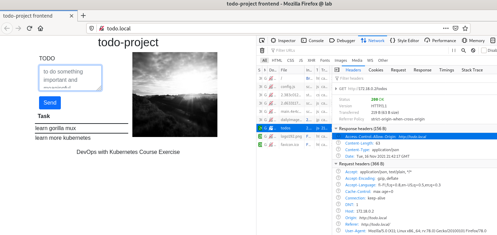
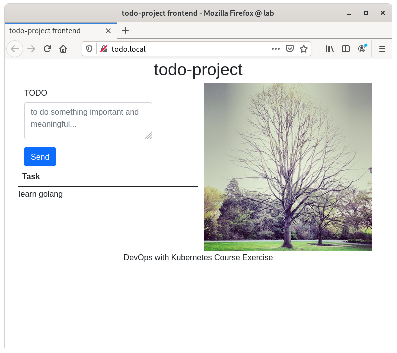
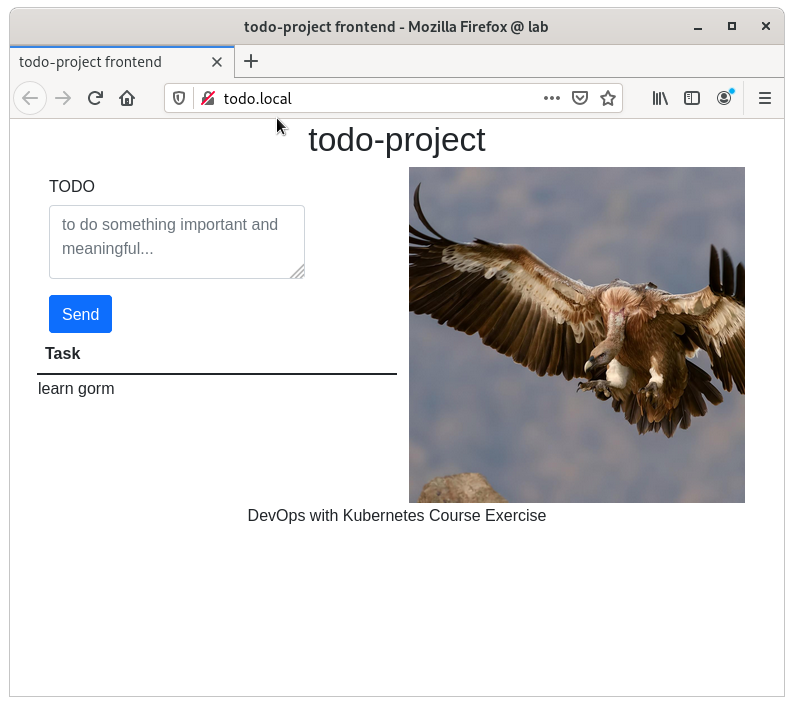

# Exercices

## 2.01

https://github.com/pasiol/log-output/tree/2.01
https://github.com/pasiol/ping-pong/tree/2.01

    k3d cluster delete && k3d cluster create --port 8082:20080@agent:0 -p 8081:80@loadbalancer --agents 2 && docker exec k3d-k3s-default-agent-0 mkdir -p /tmp/kube

    kubectl apply -f https://raw.githubusercontent.com/pasiol/ping-pong/2.01/manifests/deploymentBusyBox.yaml
    pod/busybox1 created

    kubectl apply -f https://raw.githubusercontent.com/pasiol/ping-pong/2.01/manifests/deployment.yaml
    deployment.apps/ping-pong created
    kubectl apply -f https://raw.githubusercontent.com/pasiol/ping-pong/2.01/manifests/service.yaml
    service/ping-pong-svc created
    kubectl apply -f https://raw.githubusercontent.com/pasiol/ping-pong/2.01/manifests/ingress.yaml
    ingress.networking.k8s.io/ping-pong-ingress created

    kubectl get ing
    NAME                CLASS    HOSTS   ADDRESS                            PORTS   AGE
    ping-pong-ingress   <none>   *       172.19.0.2,172.19.0.4,172.19.0.5   80      55s

    kubectl get pods
    NAME                         READY   STATUS    RESTARTS   AGE
    busybox1                     1/1     Running   0          25m
    ping-pong-5d99cfc6cb-m9v9l   1/1     Running   0          24m

    kubectl exec -it ping-pong-5d99cfc6cb-m9v9l -- curl http://172.19.0.2/pingpong
    Ping / Pongs: 1

## 2.02

- https://github.com/pasiol/todo-project-backend/tree/2.02
- https://github.com/pasiol/todo-project/tree/2.02
- https://github.com/pasiol/to-do-project-frontend/tree/2.02

todo-project includes the builded version of React-frontend.

    kubectl get nodes -o wide
    NAME                       STATUS   ROLES                  AGE    VERSION        INTERNAL-IP   EXTERNAL-IP   OS-IMAGE   KERNEL-VERSION   CONTAINER-RUNTIME
    k3d-k3s-default-agent-1    Ready    <none>                 149m   v1.21.5+k3s2   172.18.0.3    <none>        Unknown    5.10.0-9-amd64   containerd://1.4.11-k3s1
    k3d-k3s-default-agent-0    Ready    <none>                 149m   v1.21.5+k3s2   172.18.0.4    <none>        Unknown    5.10.0-9-amd64   containerd://1.4.11-k3s1
    k3d-k3s-default-server-0   Ready    control-plane,master   150m   v1.21.5+k3s2   172.18.0.2    <none>        Unknown    5.10.0-9-amd64   containerd://1.4.11-k3s1

    sudo vim /etc/hosts

    127.0.0.1	localhost
    172.86.3.1	lab

    172.18.0.2 172.18.0.3 172.18.0.4 todo.local

    # The following lines are desirable for IPv6 capable hosts
    ::1     localhost ip6-localhost ip6-loopback
    ff02::1 ip6-allnodes
    ff02::2 ip6-allrouters

    kubectl apply -f https://raw.githubusercontent.com/pasiol/todo-project-backend/2.02/manifests/deployment.yaml
    deployment.apps/todo-project-backend created

    kubectl apply -f https://raw.githubusercontent.com/pasiol/todo-project-backend/2.02/manifests/service.yaml
    service/todo-project-backend-svc created
    kubectl get svc
    NAME                       TYPE        CLUSTER-IP      EXTERNAL-IP   PORT(S)    AGE
    kubernetes                 ClusterIP   10.43.0.1       <none>        443/TCP    50m
    ping-pong-svc              ClusterIP   10.43.27.251    <none>        8888/TCP   46m
    todo-project-backend-svc   ClusterIP   10.43.175.225   <none>        8888/TCP   12s

    kubectl apply -f https://raw.githubusercontent.com/pasiol/todo-project-backend/2.02/manifests/toolbox.yaml
    pod/toolbox created

    kubectl exec -it toolbox -- curl -H "Content-Type: application/json" --request POST --data '{"task": "learn gorilla mux"}' http://10.43.175.225:8888/todos
    "new todo task created"

    kubectl get pods
    NAME                                    READY   STATUS    RESTARTS   AGE
    ping-pong-5d99cfc6cb-f9kl4              1/1     Running   0          64m
    todo-project-backend-5b99578688-5qptr   1/1     Running   0          18m
    toolbox                                 1/1     Running   0          12m
    busybox1                                1/1     Running   1          64m
    kubectl logs todo-project-backend-5b99578688-5qptr
    2021/11/16 19:52:36 Reading environment failed.
    2021/11/16 19:52:36 starting REST-backend in 0.0.0.0:8888.
    2021/11/16 19:52:36 Version: b7ab4c9989bf600f0d46c7912a0f6ee039167aaf , build: 2021-11-16T19:41:21+0000
    2021/11/16 19:52:36 Allowed origins: *
    2021/11/16 20:05:04 response bytes 4, []
    2021/11/16 20:10:06 response bytes 23, new todo task created

    kubectl apply -f https://raw.githubusercontent.com/pasiol/todo-project-backend/2.02/manifests/ingress.yaml
    ingress.networking.k8s.io/todo-project-backend-ingress created
    kubectl get ing
    NAME                           CLASS    HOSTS   ADDRESS                            PORTS   AGE
    ping-pong-ingress              <none>   *       172.18.0.2,172.18.0.3,172.18.0.4   80      66m
    todo-project-backend-ingress   <none>   *       172.18.0.2,172.18.0.3,172.18.0.4   80      8s
    kubectl delete ing ping-pong-ingress
    ingress.networking.k8s.io "ping-pong-ingress" deleted
    curl http://todo.local/todos
    [{"task":"learn gorilla mux"}]

    kubectl apply -f https://raw.githubusercontent.com/pasiol/todo-project/2.02/manifests/configMap.yaml
    configmap/web-config created
    kubectl apply -f https://raw.githubusercontent.com/pasiol/todo-project/2.02/manifests/persistentVolume.yaml
    persistentvolume/todo-project-pv created
    kubectl apply -f https://raw.githubusercontent.com/pasiol/todo-project/2.02/manifests/persistentVolumeClaim.yaml
    persistentvolumeclaim/todo-project-claim created
    kubectl apply -f https://raw.githubusercontent.com/pasiol/todo-project/2.02/manifests/deployment.yaml
    deployment.apps/todo-project created
    kubectl apply -f https://raw.githubusercontent.com/pasiol/todo-project/2.02/manifests/service.yaml
    service/todo-project-svc created
    kubectl apply -f https://raw.githubusercontent.com/pasiol/todo-project/2.02/manifests/ingress.yaml
    ingress.networking.k8s.io/todo-project-ingress created
    kubectl get pods
    NAME                                    READY   STATUS    RESTARTS   AGE
    ping-pong-5d99cfc6cb-f9kl4              1/1     Running   0          87m
    todo-project-backend-5b99578688-5qptr   1/1     Running   0          42m
    toolbox                                 1/1     Running   0          36m
    busybox1                                1/1     Running   1          87m
    todo-project-599dcd896-7gmf2            1/1     Running   0          26s
    kubectl logs todo-project-599dcd896-7gmf2
    2021/11/16 20:34:13 server started in port 3000
    2021/11/16 20:34:14 daily image getting statuscode 200
    2021/11/16 20:34:14 updated daily image succesfully

    firefox http://todo.local

## 2.03

- https://github.com/pasiol/ping-pong/tree/2.03
- https://github.com/pasiol/log-output/tree/2.03

cli:

    k3d cluster delete && k3d cluster create --port 8082:20080@agent:0 -p 8081:80@loadbalancer --agents 2 && docker exec k3d-k3s-default-agent-0 mkdir -p /tmp/kube
    kubectl create namespace applications
    kubectl config set-context --current --namespace=applications

    kubectl apply -f https://raw.githubusercontent.com/pasiol/ping-pong/2.03/manifests/deployment.yaml
    kubectl apply -f https://raw.githubusercontent.com/pasiol/ping-pong/2.03/manifests/service.yaml
    service/ping-pong-svc created
    kubectl apply -f https://raw.githubusercontent.com/pasiol/ping-pong/2.03/manifests/ingress.yaml
    ingress.networking.k8s.io/ping-pong-ingress created

    kubectl get ing
    NAME                CLASS    HOSTS   ADDRESS                            PORTS   AGE
    ping-pong-ingress   <none>   *       172.18.0.2,172.18.0.3,172.18.0.4   80      7m15s
    curl http://172.18.0.2/pingpong
    Ping / Pongs: 1

    kubectl apply -f https://raw.githubusercontent.com/pasiol/log-output/2.03/manifests/persistentVolume.yaml
    persistentvolume/log-output-pv created
    kubectl apply -f https://raw.githubusercontent.com/pasiol/log-output/2.03/manifests/persistentVolumeClaim.yaml
    persistentvolumeclaim/log-output-claim created
    kubectl apply -f https://raw.githubusercontent.com/pasiol/log-output/2.03/manifests/deployment.yaml
    deployment.apps/log-output-dep created
    kubectl apply -f https://raw.githubusercontent.com/pasiol/log-output/2.03/manifests/service.yaml
    service/log-output-svc created
    kubectl apply -f https://raw.githubusercontent.com/pasiol/log-output/2.03/manifests/ingress.yaml
    ingress.networking.k8s.io/log-output-ingress created

    NAME                 CLASS    HOSTS   ADDRESS                            PORTS   AGE
    ping-pong-ingress    <none>   *       172.18.0.2,172.18.0.3,172.18.0.4   80      16m
    log-output-ingress   <none>   *       172.18.0.2,172.18.0.3,172.18.0.4   80      36s
    curl http://172.18.0.2
    2021-11-17T14:30:49.893084222Z 177e215e-1252-4b09-8256-02aea10703cb
    Ping / Pongs: 2

## 2.04

- https://github.com/pasiol/todo-project/tree/2.04
- https://github.com/pasiol/todo-project-backend/tree/2.04

cli:

    kubectl delete ing ping-pong-ingress
    ingress.networking.k8s.io "ping-pong-ingress" deleted
    kubectl delete ing log-output-ingress
    ingress.networking.k8s.io "log-output-ingress" deleted

    kubectl create namespace todo-project
    namespace/todo-project created
      kubectl config set-context --current --namespace=todo-project
    Context "k3d-k3s-default" modified.

    kubectl apply -f https://raw.githubusercontent.com/pasiol/todo-project-backend/2.04/manifests/deployment.yaml
    deployment.apps/todo-project-backend created
    kubectl apply -f https://raw.githubusercontent.com/pasiol/todo-project-backend/2.04/manifests/service.yaml
    service/todo-project-backend-svc created
    kubectl apply -f https://raw.githubusercontent.com/pasiol/todo-project-backend/2.04/manifests/ingress.yaml
    ingress.networking.k8s.io/todo-project-backend-ingress created

    kubectl get ing
    NAME                           CLASS    HOSTS   ADDRESS                            PORTS   AGE
    todo-project-backend-ingress   <none>   *       172.18.0.2,172.18.0.3,172.18.0.4   80      11s

    curl -H "Content-Type: application/json" --request POST -d '{"task": "learn golang"}' http://todo.local/todos
    "new todo task created"
    curl http://todo.local/todos
    [{"task":"learn golang"}]

    kubectl apply -f https://raw.githubusercontent.com/pasiol/todo-project/2.04/manifests/configMap.yaml
    configmap/web-config created
    kubectl apply -f https://raw.githubusercontent.com/pasiol/todo-project/2.04/manifests/persistentVolume.yaml
    persistentvolume/todo-project-pv created
    kubectl apply -f https://raw.githubusercontent.com/pasiol/todo-project/2.04/manifests/persistentVolumeClaim.yaml
    persistentvolumeclaim/todo-project-claim created
    kubectl apply -f https://raw.githubusercontent.com/pasiol/todo-project/2.04/manifests/deployment.yaml
    deployment.apps/todo-project created
    kubectl apply -f https://raw.githubusercontent.com/pasiol/todo-project/2.04/manifests/service.yaml
    service/todo-project-svc created
    kubectl apply -f https://raw.githubusercontent.com/pasiol/todo-project/2.04/manifests/ingress.yaml
    ingress.networking.k8s.io/todo-project-ingress created
    kubectl get ing
    NAME                           CLASS    HOSTS   ADDRESS                            PORTS   AGE
    todo-project-backend-ingress   <none>   *       172.18.0.2,172.18.0.3,172.18.0.4   80      12m
    todo-project-ingress           <none>   *       172.18.0.2,172.18.0.3,172.18.0.4   80      9s

    firefox http://todo.local

## 2.05

    sudo dnf install age
    age -version
    1.0.0

    wget -c https://github.com/mozilla/sops/releases/download/v3.7.1/sops-3.7.1-1.x86_64.rpm
    sudo dnf localinstall sops-3.7.1-1.x86_64.rpm
    sops -version
    sops 3.7.1 (latest)

## 2.06

https://github.com/pasiol/log-output/tree/2.06

    kubectl config set-context --current --namespace=applications

    kubectl apply -f https://raw.githubusercontent.com/pasiol/ping-pong/2.03/manifests/deployment.yaml
    deployment.apps/ping-pong unchanged
    kubectl apply -f https://raw.githubusercontent.com/pasiol/ping-pong/2.03/manifests/service.yaml
    service/ping-pong-svc unchanged
    kubectl apply -f https://raw.githubusercontent.com/pasiol/ping-pong/2.03/manifests/ingress.yaml
    ingress.networking.k8s.io/ping-pong-ingress created

    kubectl apply -f https://raw.githubusercontent.com/pasiol/log-output/2.06/manifests/persistentVolume.yaml
    persistentvolume/log-output-pv unchanged
    kubectl apply -f https://raw.githubusercontent.com/pasiol/log-output/2.06/manifests/persistentVolumeClaim.yaml
    persistentvolumeclaim/log-output-claim unchanged
    kubectl apply -f https://raw.githubusercontent.com/pasiol/log-output/2.06/manifests/configMap.yaml
    configmap/exercise-variables created
    kubectl apply -f https://raw.githubusercontent.com/pasiol/log-output/2.06/manifests/deployment.yaml
    deployment.apps/log-output-dep configured
    kubectl apply -f https://raw.githubusercontent.com/pasiol/log-output/2.06/manifests/service.yaml
    service/log-output-svc unchanged
    kubectl apply -f https://raw.githubusercontent.com/pasiol/log-output/2.06/manifests/ingress.yaml
    ingress.networking.k8s.io/log-output-ingress created

    kubectl get ing
    NAME                 CLASS    HOSTS   ADDRESS                            PORTS   AGE
    ping-pong-ingress    <none>   *       172.18.0.2,172.18.0.3,172.18.0.4   80      3h25m
    log-output-ingress   <none>   *       172.18.0.2,172.18.0.3,172.18.0.4   80      3h22m
    curl 172.18.0.2
    Hello
    2021-11-18T20:25:58.127894419Z 08ea40ef-4842-4673-90b9-046897177112
    Ping / Pongs: 9

## 2.07

https://github.com/pasiol/ping-pong/tree/2.07

    cat /etc/hosts | grep 172.18.0.2
    172.18.0.2 172.18.0.3 172.18.0.4 todo.local log-output.local

    age-keygen -o course_key.txt
    Public key: age1kdhxyxzul9q095wq9rc3hfkc4ukt2yze2474f46pk84wl5c7l4kqlxurfl
    cat course_key.txt
    # created: 2021-11-20T17:25:41+02:00
    # public key: age1kdhxyxzul9q095wq9rc3hfkc4ukt2yze2474f46pk84wl5c7l4kqlxurfl
    AGE-SECRET-KEY-NNNNNNNNNNNNNNNNNNNNNNNNNNNNNNNNNNNNNNNNNNNNNNNNNNNNNNNNNNN

    kubectl config set-context --current --namespace=application

    echo -n "testersecret" | base64
    dGVzdGVyc2VjcmV0
    echo -n "testingsecret" | base64
    dGVzdGluZ3NlY3JldA==

    sops  --encrypt --age age1kdhxyxzul9q095wq9rc3hfkc4ukt2yze2474f46pk84wl5c7l4kqlxurfl --encrypted-regex '^(data)$' secrets.yaml > secrets.enc.yaml
    shred -u -n 100 secrets.yaml

    export SOPS_AGE_KEY_FILE=$(pwd)/course_key.txt

    curl https://raw.githubusercontent.com/pasiol/ping-pong/2.07/manifests/secrets.enc.yaml > secrets.enc.yaml && sops --decrypt secrets.enc.yaml > secrets.yaml

    kubectl apply -f secrets.yaml
    secret/postgres created

    shred -u -n 100 secret*

    kubectl apply -f https://raw.githubusercontent.com/pasiol/ping-pong/2.07/manifests/persistentVolume.yaml
    persistentvolume/pingpong-pv created
    kubectl apply -f https://raw.githubusercontent.com/pasiol/ping-pong/2.07/manifests/persistentVolumeClaim.yaml
    persistentvolumeclaim/pingpong-pvc created

    kubectl apply -f https://raw.githubusercontent.com/pasiol/ping-pong/2.07/manifests/deployment.yaml
    deployment.apps/ping-pong created
    kubectl apply -f https://raw.githubusercontent.com/pasiol/ping-pong/2.07/manifests/service.yaml
    service/ping-pong-svc unchanged
    kubectl apply -f https://raw.githubusercontent.com/pasiol/ping-pong/2.07/manifests/ingress.yaml
    ingress.networking.k8s.io/ping-pong-ingress unchanged

    kubectl get ing
    NAME                 CLASS    HOSTS   ADDRESS                            PORTS   AGE
    ping-pong-ingress    <none>   *       172.18.0.2,172.18.0.3,172.18.0.4   80      47h
    log-output-ingress   <none>   *       172.18.0.2,172.18.0.3,172.18.0.4   80      47h

    curl http://172.18.0.2
    Hello
    2021-11-20T16:42:11.39097228Z 34c2cd55-1a70-41ad-87f4-523105b9a80f
    Ping / Pongs: 1

    kubectl get pods
    NAME                             READY   STATUS    RESTARTS   AGE
    log-output-dep-64cb7bdd5-sz7nd   2/2     Running   0          79m
    ping-pong-6ff5c66d74-j6sqh       2/2     Running   0          6m2s

    kubectl logs ping-pong-6ff5c66d74-j6sqh postgres-pingpong

    PostgreSQL Database directory appears to contain a database; Skipping initialization

    2021-11-20 16:36:41.961 UTC [1] LOG:  starting PostgreSQL 13.5 (Debian 13.5-1.pgdg110+1) on x86_64-pc-linux-gnu, compiled by gcc (Debian 10.2.1-6) 10.2.1 20210110, 64-bit
    2021-11-20 16:36:41.962 UTC [1] LOG:  listening on IPv4 address "0.0.0.0", port 5432
    2021-11-20 16:36:41.962 UTC [1] LOG:  listening on IPv6 address "::", port 5432
    2021-11-20 16:36:41.966 UTC [1] LOG:  listening on Unix socket "/var/run/postgresql/.s.PGSQL.5432"
    2021-11-20 16:36:41.971 UTC [27] LOG:  database system was shut down at 2021-11-20 15:14:43 UTC
    2021-11-20 16:36:41.979 UTC [1] LOG:  database system is ready to accept connections
    kubectl logs ping-pong-6ff5c66d74-j6sqh pingpong
    error: container pingpong is not valid for pod ping-pong-6ff5c66d74-j6sqh

    kubectl logs ping-pong-6ff5c66d74-j6sqh ping-pong
    2021/11/20 16:36:42 Reading environment failed.
    2021/11/20 16:36:42 counter is 0
    2021/11/20 16:36:42 starting pingpong server in 0.0.0.0:8888.
    2021/11/20 16:36:42 Version:  , build:
    2021/11/20 16:36:42 Allowed origins: http://log-output.local
    2021/11/20 16:42:13 written 16 bytes address 10.42.2.19:51630: Ping / Pongs: 1

    kubectl rollout restart deployments/ping-pong
    deployment.apps/ping-pong restarted

    kubectl get pods
    NAME                             READY   STATUS    RESTARTS   AGE
    log-output-dep-64cb7bdd5-sz7nd   2/2     Running   0          105m
    ping-pong-74c56d8564-wwvgg       2/2     Running   0          15s

    curl http://172.18.0.2
    Hello
    2021-11-20T17:08:57.415956935Z 3a315bb0-9f81-4840-b585-5181d7490cb6
    Ping / Pongs: 13

## 2.08

    sops  --encrypt --age age1kdhxyxzul9q095wq9rc3hfkc4ukt2yze2474f46pk84wl5c7l4kqlxurfl --encrypted-regex '^(data)$' ./manifests/secret.yaml > ./manifests/secret.enc.yaml

    kubectl config set-context --current --namespace=todo-project

    kubectl apply -f https://raw.githubusercontent.com/pasiol/todo-project-backend/2.08/manifests/persistentVolume.yaml
    persistentvolume/todo-project-backend-pv created
    kubectl apply -f https://raw.githubusercontent.com/pasiol/todo-project-backend/2.08/manifests/persistentVolumeClaim.yaml
    persistentvolumeclaim/todo-project-pvc created

    export SOPS_AGE_KEY_FILE=$(pwd)/course_key.txt
    curl https://raw.githubusercontent.com/pasiol/todo-project-backend/2.08/manifests/secret.enc.yaml > secret.enc.yaml && sops --decrypt secret.enc.yaml > secret.yaml
    kubectl apply -f secret.yaml
    secret/postgres created

    kubectl apply -f https://raw.githubusercontent.com/pasiol/todo-project-backend/2.08/manifests/postgres/deployment.yaml
    deployment.apps/todo-project-backend-db created

    kubectl get pods
    NAME                                       READY   STATUS    RESTARTS   AGE
    todo-project-599dcd896-zgxn4               1/1     Running   0          3d19h
    todo-project-backend-c5b7fb6c5-ksdcw       1/1     Running   0          3d19h
    todo-project-backend-db-645699d7fb-kxptn   1/1     Running   0          25s

    kubectl logs todo-project-backend-db-645699d7fb-kxptn
    The files belonging to this database system will be owned by user "postgres".
    This user must also own the server process.
    ...
    waiting for server to shut down...2021-11-21 10:42:49.679 UTC [50] LOG:  received fast shutdown request
    .2021-11-21 10:42:49.683 UTC [50] LOG:  aborting any active transactions
    2021-11-21 10:42:49.692 UTC [50] LOG:  background worker "logical replication launcher" (PID 57) exited with exit code 1
    2021-11-21 10:42:49.695 UTC [52] LOG:  shutting down
    2021-11-21 10:42:49.728 UTC [50] LOG:  database system is shut down
     done
    server stopped

    PostgreSQL init process complete; ready for start up.

    2021-11-21 10:42:49.844 UTC [1] LOG:  starting PostgreSQL 13.5 (Debian 13.5-1.pgdg110+1) on x86_64-pc-linux-gnu, compiled by gcc (Debian 10.2.1-6) 10.2.1 20210110, 64-bit
    2021-11-21 10:42:49.844 UTC [1] LOG:  listening on IPv4 address "0.0.0.0", port 5432
    2021-11-21 10:42:49.844 UTC [1] LOG:  listening on IPv6 address "::", port 5432
    2021-11-21 10:42:49.852 UTC [1] LOG:  listening on Unix socket "/var/run/postgresql/.s.PGSQL.5432"
    2021-11-21 10:42:49.866 UTC [64] LOG:  database system was shut down at 2021-11-21 10:42:49 UTC
    2021-11-21 10:42:49.883 UTC [1] LOG:  database system is ready to accept connections

    kubectl apply -f https://raw.githubusercontent.com/pasiol/todo-project-backend/2.08/manifests/postgres/service.yaml
    service/todo-project-backend-db-svc created

    kubectl apply -f https://raw.githubusercontent.com/pasiol/todo-project-backend/2.08/manifests/configMap.yaml
    configmap/todo-db-host created

    kubectl apply -f https://raw.githubusercontent.com/pasiol/todo-project-backend/2.08/manifests/deployment.yaml
deployment.apps/todo-project-backend created

    kubectl get pods
    NAME                                       READY   STATUS    RESTARTS   AGE
    todo-project-599dcd896-zgxn4               1/1     Running   0          3d20h
    todo-project-backend-9fbc448f-4rg99        1/1     Running   0          62s
    todo-project-backend-db-84b4f6644c-75kzl   1/1     Running   1          101s

    kubectl logs todo-project-backend-9fbc448f-4rg99
    2021/11/21 11:44:48 connected to db: &{0 {{{todo-project-backend-db-svc 5432 todos testersecret testingsecret <nil> 0 0x69ec60 0x7d5520 0x7d4b00 map[TimeZone:Europe/Helsinki timezone:Europe/Helsinki] [] <nil> <nil> <nil> <nil> true} <nil> 4 host=todo-project-backend-db-svc user=testersecret password=testingsecret dbname=todos port=5432 sslmode=disable TimeZone=Europe/Helsinki 0x8c7680 true true} 0x8cd8e0 0x8cd900 0x8cd920 0xc00000ca98} 0 {0 0} [0xc0002002d0] map[] 0 1 0xc000074240 false map[0xc0002002d0:map[0xc0002002d0:true]] map[] 0 0 0 0 <nil> 0 0 0 0 0x4f0520}
    2021/11/21 11:44:48 starting REST-backend in 0.0.0.0:8888.
    2021/11/21 11:44:48 Version: e54ad9f17a0d074b8c8e881846c02aa13266d1d9 , build: 2021-11-21T07:19:10+0000
    2021/11/21 11:44:48 Allowed origins: http://todo.local

    kubectl apply -f https://raw.githubusercontent.com/pasiol/todo-project-backend/2.08/manifests/service.yaml
    service/todo-project-backend-svc unchanged
    pasiol@lab:~$ kubectl apply -f https://raw.githubusercontent.com/pasiol/todo-project-backend/2.08/manifests/ingress.yaml
    ingress.networking.k8s.io/todo-project-backend-ingress created

    pasiol@lab:~$ kubectl get ing
    NAME                           CLASS    HOSTS   ADDRESS                            PORTS   AGE
    todo-project-backend-ingress   <none>   *       172.18.0.2,172.18.0.3,172.18.0.4   80      3m6s
    curl -H "Content-Type: application/json" --request POST -d '{"task": "learn gorm"}' http://todo.local/todos
    "new todo taskcurl http://todo.local/todoshttp://todo.local/todos
    [{"task":"learn gorm"}]

    kubectl apply -f https://raw.githubusercontent.com/pasiol/todo-project/2.04/manifests/ingress.yaml
    ingress.networking.k8s.io/todo-project-ingress created
    pasiol@lab:~$ kubectl get ing
    NAME                           CLASS    HOSTS   ADDRESS                            PORTS   AGE
    todo-project-backend-ingress   <none>   *       172.18.0.2,172.18.0.3,172.18.0.4   80      5m59s
    todo-project-ingress           <none>   *       172.18.0.2,172.18.0.3,172.18.0.4   80      16s

    kubectl rollout restart deployments/todo-project
    deployment.apps/todo-project restarted

    firefox http://todo.local

