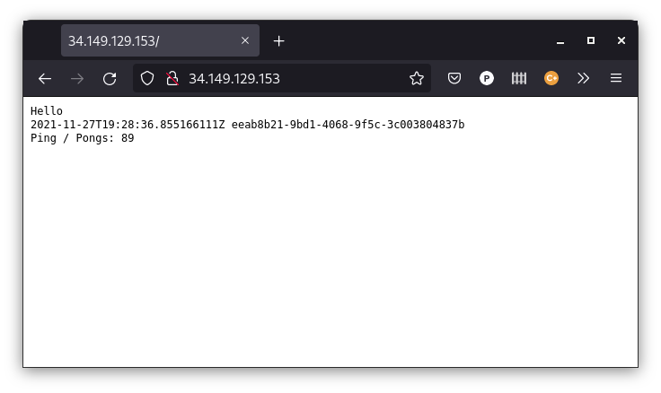
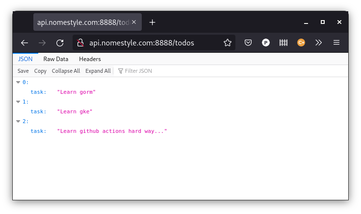
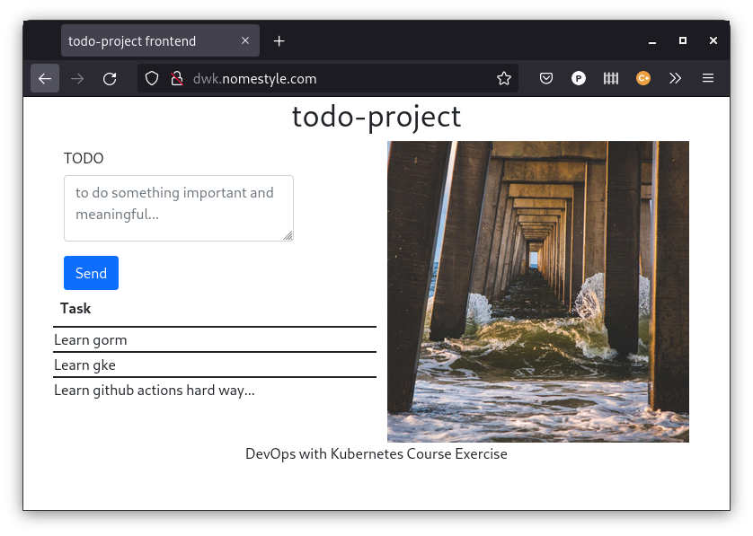
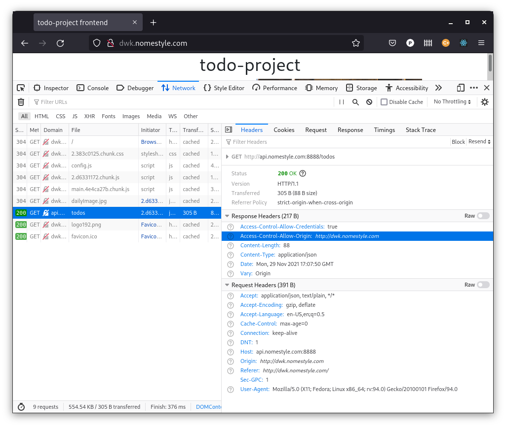
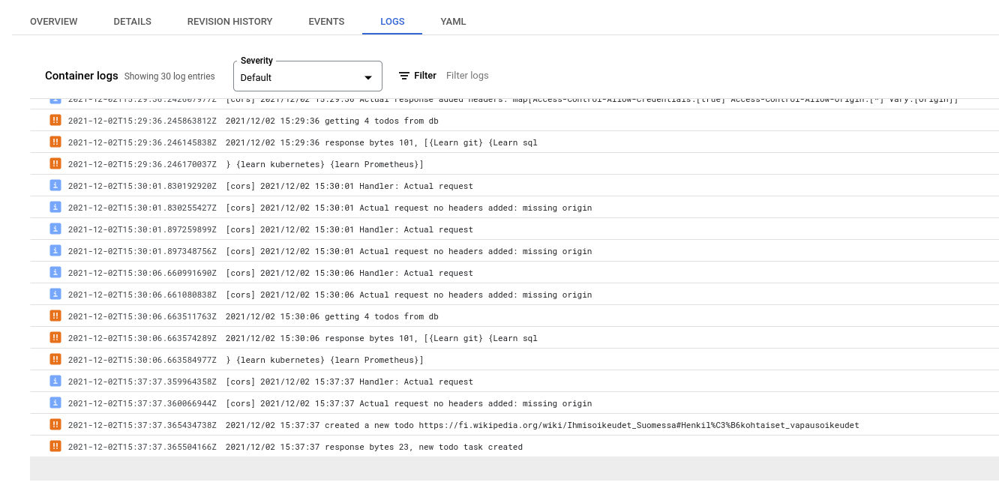
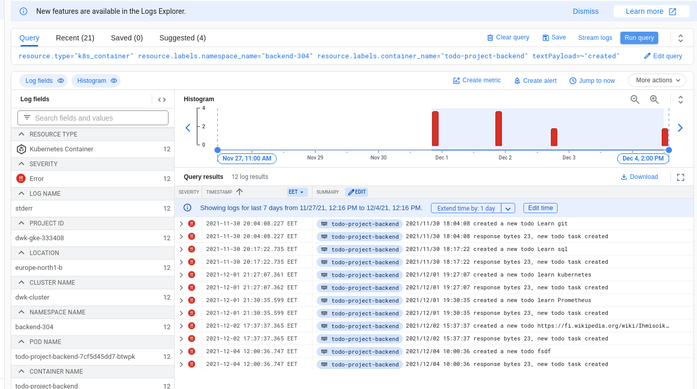

# Exercices

https://cloud.google.com/sdk/docs/install

## 3.01

    gcloud -v
    Google Cloud SDK 365.0.1
    alpha 2021.11.19
    beta 2021.11.19
    bq 2.0.71
    core 2021.11.19
    gsutil 5.5

    gcloud auth login
    ...

    gcloud config set project dwk-gke-NNNNNNNN

    gcloud services enable container.googleapis.com
    Operation "operations/acf.p2-877673692371-50b09dcb-4106-40b9-bdee-1ee2d02d461f" finished successfully.

    gcloud container clusters create dwk-cluster --zone=europe-north1-b --release-channel=rapid --cluster-version=1.22

    ...
    Creating cluster dwk-cluster in europe-north1-b...done.
    ...

    gcloud components install kubectl
    ERROR: (gcloud.components.install)
    You cannot perform this action because the Cloud SDK component manager
    is disabled for this installation. You can run the following command
    to achieve the same result for this installation:

    sudo apt-get install kubectl

    sudo apt-get install kubectl
    ...

    gcloud container clusters get-credentials dwk-cluster --zone=europe-north1-b
    kubectl create namespace applications
    kubectl config set-context --current --namespace=applications

    wget -c https://raw.githubusercontent.com/pasiol/ping-pong/3.01/manifests/secrets.enc.yaml && sops --decrypt secrets.enc.yaml > secrets.yaml
    kubectl apply -f secrets.yaml

    kubectl apply -f https://raw.githubusercontent.com/pasiol/ping-pong/3.01/manifests/persistentVolumeClaim.yaml
    persistentvolumeclaim/pingpong-pvc created

    kubectl apply -f https://raw.githubusercontent.com/pasiol/ping-pong/3.01/manifests/postgres/service.yaml
    service/ping-pong-postgres-svc created
    kubectl apply -f https://raw.githubusercontent.com/pasiol/ping-pong/3.01/manifests/service.yaml
    service/ping-pong-svc created

    kubectl apply -f https://raw.githubusercontent.com/pasiol/ping-pong/3.01/manifests/postgres/deployment.yaml
    deployment.apps/ping-pong-postgres created

    kubectl apply -f https://raw.githubusercontent.com/pasiol/ping-pong/3.01/manifests/deployment.yaml
    deployment.apps/ping-pong created

    kubectl get svc

    NAME                     TYPE           CLUSTER-IP     EXTERNAL-IP      PORT(S)          AGE
    ping-pong-postgres-svc   ClusterIP      10.32.12.8     <none>           5432/TCP         6m14s
    ping-pong-svc            LoadBalancer   10.32.13.131   35.228.215.149   8888:31149/TCP   34m

    curl http://35.228.215.149:8888/pingpong
    Ping / Pongs: 1

    kubectl get svc
NAME                     TYPE        CLUSTER-IP     EXTERNAL-IP   PORT(S)        AGE
ping-pong-postgres-svc   ClusterIP   10.32.12.8     <none>        5432/TCP       67m
ping-pong-svc            NodePort    10.32.13.131   <none>        80:31149/TCP   95m

## 3.02

    kubectl apply -f https://raw.githubusercontent.com/pasiol/todo-project-backend/2.02/manifests/toolbox.yaml

    kubectl apply -f https://raw.githubusercontent.com/pasiol/ping-pong/3.02/manifests/service.yaml
    service/ping-pong-svc created

    kubectl exec -it toolbox -- curl http://10.32.13.131/pingpong
    Ping / Pongs: 7

    kubectl apply -f https://raw.githubusercontent.com/pasiol/log-output/3.02/manifests/persistentVolumeClaim.yaml
    persistentvolumeclaim/log-output-pvc created
    kubectl apply -f https://raw.githubusercontent.com/pasiol/log-output/3.02/manifests/configMap.yaml
    configmap/exercise-variables created

    kubectl apply -f https://raw.githubusercontent.com/pasiol/log-output/3.02/manifests/deployment.yaml
    deployment.apps/log-output-dep created

    kubectl apply -f https://raw.githubusercontent.com/pasiol/log-output/3.02/manifests/service.yaml
    service/log-output-svc created

    kubectl get svc
    NAME                     TYPE        CLUSTER-IP     EXTERNAL-IP   PORT(S)        AGE
    log-output-svc           NodePort    10.32.1.241    <none>        80:30520/TCP   8m44s
    ping-pong-postgres-svc   ClusterIP   10.32.12.8     <none>        5432/TCP       88m
    ping-pong-svc            NodePort    10.32.13.131   <none>        80:31149/TCP   115m
    kubectl exec -it toolbox -- curl http://log-output-svc
    Hello
    2021-11-27T19:21:06.622621373Z 320ef2aa-a023-4e36-a781-a313ce6287c5
    Ping / Pongs: 46

    kubectl get ing
    NAME                   CLASS    HOSTS   ADDRESS          PORTS   AGE
    applications-ingress   <none>   *       34.149.129.153   80      2m34s

## 3.03

- https://kubernetes.io/docs/tasks/manage-kubernetes-objects/kustomization/
- https://kubectl.docs.kubernetes.io/

Backend

Changed gorilla cors to rs cors.

Secrets installed from gcloud cli:

- https://github.com/pasiol/todo-project-backend/tree/3.03_rs_cors
- https://github.com/pasiol/todo-project-backend/actions/runs/1516992076

Frontend

- https://github.com/pasiol/todo-project/tree/3.03
- https://github.com/pasiol/todo-project/actions/runs/1516620548

TODO: Why gorilla handlers do not send "Access-Control-Allow-Origin" header in gke?

## 3.04

http://dwk.nomestyle.com/
http://api.nomestyle.com:8888/todos

Backend

https://github.com/pasiol/todo-project-backend/tree/backend-304
https://github.com/pasiol/todo-project-backend/actions/runs/1521899639

Frontend

https://github.com/pasiol/todo-project/tree/backend-304
https://github.com/pasiol/todo-project/actions/runs/1521987541

## 3.05

- https://docs.github.com/en/developers/webhooks-and-events/webhooks/webhook-events-and-payloads#delete

On todo-project-backend-repo

- https://github.com/pasiol/todo-project-backend/actions/runs/1531220755

    git push origin backend-305

On project-todo-repo

    git push origin backend-305

- https://github.com/pasiol/todo-project/actions/runs/1531233488

https://raw.githubusercontent.com/pasiol/todo-project-backend/main/.github/workflows/delete.yaml

    git push origin -d backend-305

https://github.com/pasiol/todo-project-backend/actions/runs/1531253348

## 3.06

### DBaaS vs DIY

https://github.com/pasiol/todo-project

## 3.07

### Commitment

https://github.com/pasiol/todo-project

http://api.nomestyle.com:8888/todos

Backend

https://github.com/pasiol/todo-project-backend/tree/backend-304
https://github.com/pasiol/todo-project-backend/actions/runs/1521899639

## 3.08

- https://github.com/pasiol/todo-project-backend/tree/backend-308
- https://github.com/pasiol/todo-project/tree/backend-308

    kubectl get deployments --watch
    kubectl get pods --watch

    kubectl get svc
    NAME                          TYPE           CLUSTER-IP   EXTERNAL-IP    PORT(S)          AGE
    todo-project-backend-db-svc   ClusterIP      10.32.2.12   <none>         5432/TCP         18m
    todo-project-backend-svc      LoadBalancer   10.32.2.53   34.88.105.91   8888:31328/TCP   18m

    curl -H "Content-Type: application/json" --request POST --data '{"task": "learn kubernetes"}' http://34.88.105.91:8888/todos
    "new todo task created"curl -H "Content-Type: application/json" --request POST --data '{"task": "learn golang"}' http://34.88.105.91:8888/todos
    "new todo task created"curl -H "Content-Type: application/json" --request POST --data '{"task": "learn python"}' http://34.88.105.91:8888/todos

    kubectl get hpa
    NAME                   REFERENCE                         TARGETS         MINPODS   MAXPODS   REPLICAS   AGE
    todo-project-backend   Deployment/todo-project-backend   <unknown>/50%   1         6         1          84s

    echo "GET http://34.88.105.91:8888/todos"| ./vegeta attack -duration=15s | tee results.bin | ./vegeta report
    Requests      [total, rate, throughput]         750, 50.08, 0.12
    Duration      [total, attack, wait]             40.527s, 14.977s, 25.55s
    Latencies     [min, mean, 50, 90, 95, 99, max]  269.605ms, 29.103s, 30.004s, 30.007s, 30.008s, 30.013s, 30.038s
    Bytes In      [total, mean]                     385, 0.51
    Bytes Out     [total, mean]                     0, 0.00
    Success       [ratio]                           0.67%
    Status Codes  [code:count]                      0:745  200:5  
    Error Set:
    Get "http://34.88.105.91:8888/todos": context deadline exceeded (Client.Timeout exceeded while awaiting headers)
    Get "http://34.88.105.91:8888/todos": read tcp 192.168.122.178:44155->34.88.105.91:8888: read: connection reset by peer
    Get "http://34.88.105.91:8888/todos": read tcp 192.168.122.178:33573->34.88.105.91:8888: read: connection reset by peer
    Get "http://34.88.105.91:8888/todos": read tcp 192.168.122.178:58485->34.88.105.91:8888: read: connection reset by peer (Client.Timeout exceeded while awaiting headers)
    Get "http://34.88.105.91:8888/todos": read tcp 192.168.122.178:57101->34.88.105.91:8888: read: connection reset by peer
    Get "http://34.88.105.91:8888/todos": read tcp 192.168.122.178:35807->34.88.105.91:8888: read: connection reset by peer

    kubectl get pods --watch
    NAME                                       READY   STATUS    RESTARTS   AGE
    todo-project-backend-6cdc8dbb56-7rp54      1/1     Running   0          2m47s
    todo-project-backend-db-6447c64bf4-nfdvc   1/1     Running   0          29m
    todo-project-backend-6cdc8dbb56-7rp54      0/1     OOMKilled   0          5m35s
    todo-project-backend-6cdc8dbb56-7rp54      1/1     Running     1 (4s ago)   5m38s

    kubectl get deployments --watch
    NAME                      READY   UP-TO-DATE   AVAILABLE   AGE
    todo-project-backend      1/1     1            1           28m
    todo-project-backend-db   1/1     1            1           28m
    todo-project-backend      0/1     1            0           32m
    todo-project-backend      1/1     1            1           32m

    curl http://34.88.105.91:8888/todos
    [{"task":"learn kubernetes"},{"task":"learn golang"},{"task":"learn python"}]

## 3.09

- https://github.com/pasiol/ping-pong/tree/applications-309
- https://github.com/pasiol/log-output/tree/applications-309

      kubectl get svc
    NAME                     TYPE        CLUSTER-IP    EXTERNAL-IP   PORT(S)        AGE
    log-output-svc           NodePort    10.32.5.224   <none>        80:30009/TCP   57m
    ping-pong-postgres-svc   ClusterIP   10.32.12.47   <none>        5432/TCP       97m
    ping-pong-svc            ClusterIP   10.32.4.198   <none>        80/TCP         97m
    kubectl get ing
    NAME                   CLASS    HOSTS   ADDRESS        PORTS   AGE
    applications-ingress   <none>   *       34.96.64.155   80      57m

    NAME             REFERENCE                   TARGETS   MINPODS   MAXPODS   REPLICAS   AGE
    log-output-hpv   Deployment/log-output-dep   0%/50%    1         6         1          12m
    ping-pong        Deployment/ping-pong        2%/50%    1         6         1          98m

    echo "GET http://34.96.64.155"| ./vegeta attack -duration=2s | tee results.bin | ./vegeta report
    Requests      [total, rate, throughput]         100, 50.50, 4.54
    Duration      [total, attack, wait]             6.823s, 1.98s, 4.843s
    Latencies     [min, mean, 50, 90, 95, 99, max]  37.588ms, 2.977s, 3.23s, 4.757s, 4.869s, 6.271s, 6.323s
    Bytes In      [total, mean]                     25734, 257.34
    Bytes Out     [total, mean]                     0, 0.00
    Success       [ratio]                           31.00%
    Status Codes  [code:count]                      200:31  502:69  
    Error Set:
    502 Bad Gateway

    kubectl get deployment --watch
    NAME                 READY   UP-TO-DATE   AVAILABLE   AGE
    log-output-dep       1/1     1            1           112s
    ping-pong            1/1     1            1           118m
    ping-pong-postgres   1/1     1            1           118m
    log-output-dep       0/1     1            0           2m7s
    log-output-dep       1/1     1            1           2m9s
    ping-pong-postgres   0/1     1            0           119m
    ping-pong-postgres   1/1     1            1           119m

    kubectl get pods --watch
    NAME                                  READY   STATUS    RESTARTS   AGE
    log-output-dep-84bf85598f-wwbjx       2/2     Running   0          98s
    ping-pong-f4bddc6f6-f2d24             1/1     Running   0          26m
    ping-pong-postgres-5ff5f79966-6zgnm   1/1     Running   0          118m
    log-output-dep-84bf85598f-wwbjx       1/2     OOMKilled   0          2m7s
    log-output-dep-84bf85598f-wwbjx       2/2     Running     1 (1s ago)   2m8s
    ping-pong-postgres-5ff5f79966-6zgnm   0/1     OOMKilled   0            119m
    ping-pong-postgres-5ff5f79966-6zgnm   1/1     Running     1 (1s ago)   119m

    curl http://34.96.64.155
    Hello
    2021-12-01T19:14:57.633904437Z fa3a9f5a-582f-4dc9-b5bd-a4fc7705f566
    Ping / Pongs: 265

## 3.10

    curl -H "Content-Type: application/json" --request POST --data '{"task": "https://fi.wikipedia.org/wiki/Ihmisoikeudet_Suomessa#Henkil%C3%B6kohtaiset_vapausoikeudet"}' http://api.nomestyle.com:8888/todos
    "new todo task created"

    curl https://raw.githubusercontent.com/GoogleCloudPlatform/k8s-node-tools/master/os-audit/cos-auditd-logging.yaml > cos-auditd-logging.yaml
      % Total    % Received % Xferd  Average Speed   Time    Time     Time  Current
                                     Dload  Upload   Total   Spent    Left  Speed
    100  5124  100  5124    0     0   9419      0 --:--:-- --:--:-- --:--:--  9541

    kubectl apply -f cos-auditd-logging.yaml
    namespace/cos-auditd created
    Warning: spec.template.metadata.annotations[scheduler.alpha.kubernetes.io/critical-pod]: non-functional in v1.16+; use the "priorityClassName" field instead
    daemonset.apps/cos-auditd-logging created
    configmap/fluentd-gcp-config-cos-auditd created

    kubectl get pods --namespace=cos-auditd
    NAME                       READY   STATUS            RESTARTS   AGE
    cos-auditd-logging-45jlw   0/1     PodInitializing   0          28s
    cos-auditd-logging-jx4dn   0/1     PodInitializing   0          28s
    cos-auditd-logging-nrthm   0/1     PodInitializing   0          28s

    kubectl get pods --namespace=cos-auditd
    NAME                       READY   STATUS    RESTARTS   AGE
    cos-auditd-logging-45jlw   1/1     Running   0          38s
    cos-auditd-logging-jx4dn   1/1     Running   0          38s
    cos-auditd-logging-nrthm   1/1     Running   0          38s

