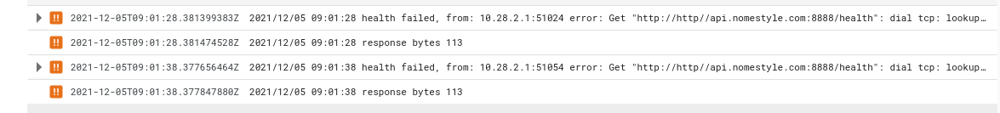
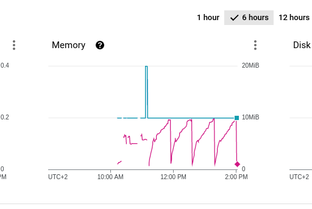
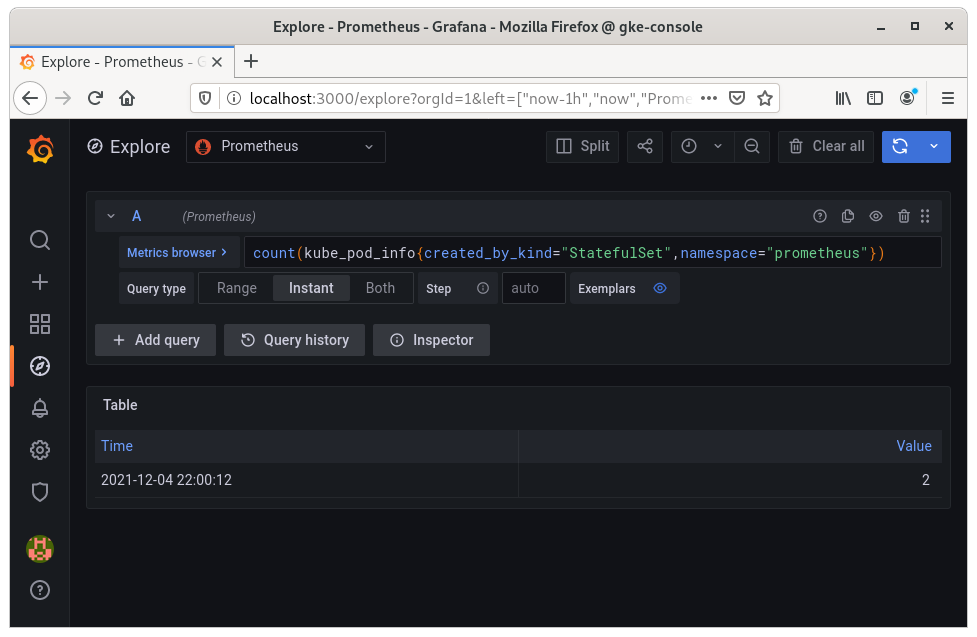
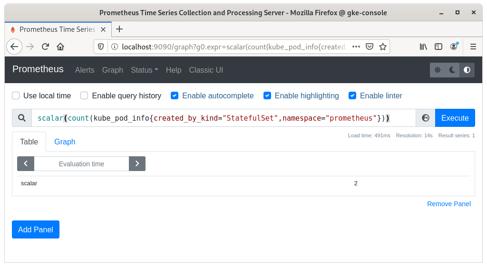
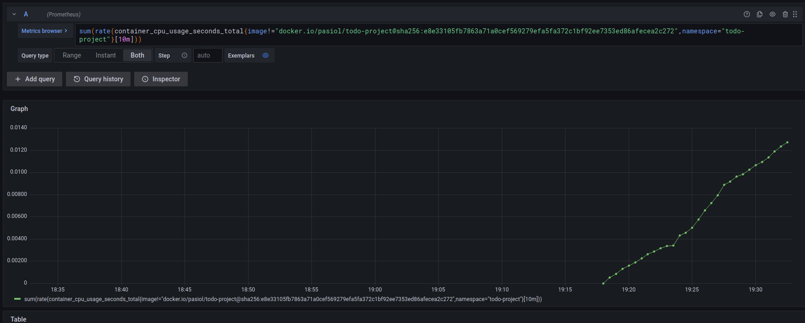
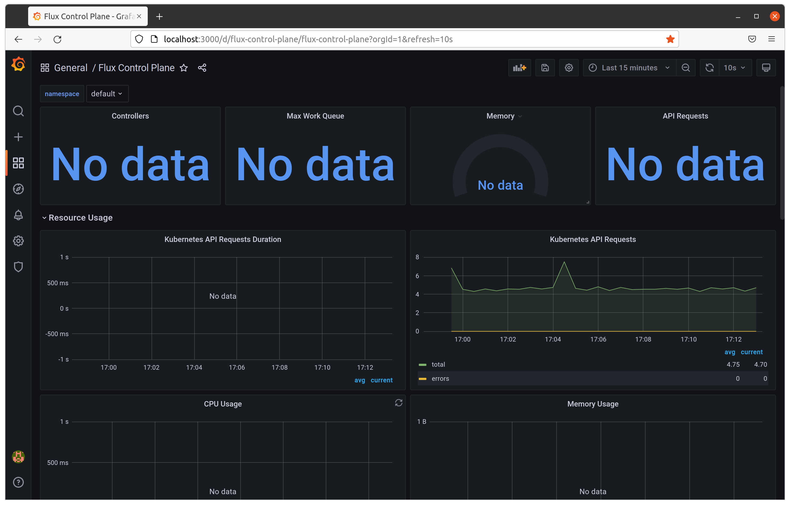
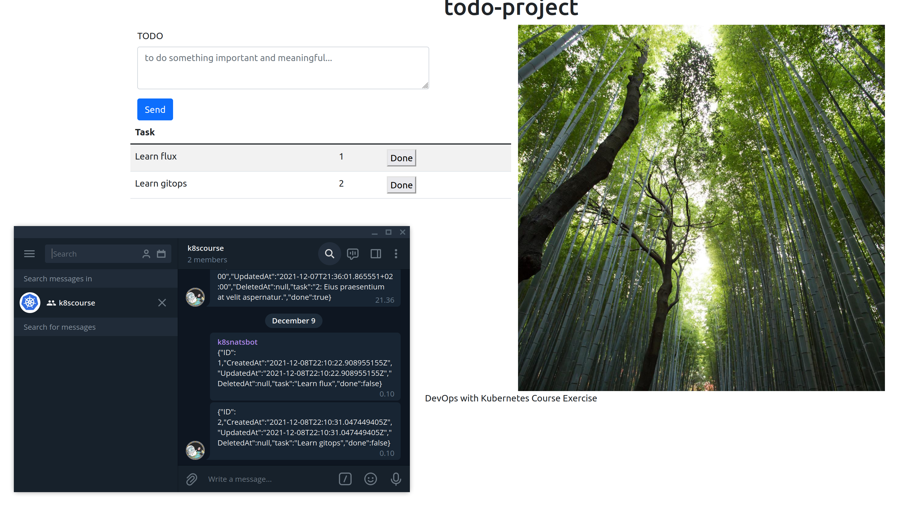

# Exercices

## 4.01

- https://github.com/pasiol/ping-pong/tree/exercise401
- https://github.com/pasiol/log-output/tree/exercise401

pingpong-deployment get stuck because of pvc is commented out in kustomization file. Service starting later when pvc deployed manually.

- https://github.com/pasiol/ping-pong/actions/runs/1538870127
- https://github.com/pasiol/log-output/actions/runs/1539176462

console:

    kubectl config set-context --current --namespace=exercise401

    kubectl get pods

    NAME                                  READY   STATUS    RESTARTS   AGE
    log-output-dep-dfc6d5945-bwtpq        1/2     Running   0          4m21s
    ping-pong-799b5868b5-27srr            0/1     Running   0          10m
    ping-pong-postgres-5ff5f79966-9ptz5   0/1     Pending   0          10m

    kubectl apply -f tmp/pvc.yaml
    persistentvolumeclaim/pingpong-pvc created

    kubectl get pods

    NAME                                  READY   STATUS    RESTARTS   AGE
    log-output-dep-dfc6d5945-bwtpq        1/2     Running   0          5m9s
    ping-pong-799b5868b5-27srr            0/1     Running   0          11m
    ping-pong-postgres-5ff5f79966-9ptz5   0/1     Pending   0          11m

    kubectl get pods

    NAME                                  READY   STATUS    RESTARTS   AGE
    log-output-dep-dfc6d5945-bwtpq        1/2     Running   0          5m33s
    ping-pong-799b5868b5-27srr            0/1     Running   0          11m
    ping-pong-postgres-5ff5f79966-9ptz5   1/1     Running   0          11m

    kubectl get pods
    NAME                                  READY   STATUS              RESTARTS      AGE
    log-output-dep-dfc6d5945-bwtpq        1/2     Running             0             6m10s
    ping-pong-799b5868b5-27srr            1/1     Running             1 (25s ago)   12m
    ping-pong-799b5868b5-6znr8            0/1     ContainerCreating   0             1s
    ping-pong-postgres-5ff5f79966-9ptz5   1/1     Running             0             12m

    kubectl get pods

    NAME                                  READY   STATUS    RESTARTS      AGE
    log-output-dep-dfc6d5945-bwtpq        2/2     Running   0             6m43s
    ping-pong-799b5868b5-27srr            1/1     Running   1 (58s ago)   12m
    ping-pong-799b5868b5-6znr8            1/1     Running   0             34s
    ping-pong-postgres-5ff5f79966-9ptz5   1/1     Running   0             12m

    kubectl get ing

    NAME                   CLASS    HOSTS   ADDRESS        PORTS   AGE
    applications-ingress   <none>   *       34.96.64.155   80      7m51s

    curl http://34.96.64.155/health
    {"message":"ok"}

    curl http://34.96.64.155/

    <pre>Hello
    2021-12-04T15:45:19.491421667Z c8c5e457-9d1a-4292-a44a-d09b36256c8c
    Ping / Pongs: 32
    </pre>

    kubectl get svc
    NAME                     TYPE        CLUSTER-IP    EXTERNAL-IP   PORT(S)        AGE
    log-output-svc           NodePort    10.32.1.25    <none>        80:30405/TCP   8m51s
    ping-pong-postgres-svc   ClusterIP   10.32.1.255   <none>        5432/TCP       14m
    ping-pong-svc            ClusterIP   10.32.14.24   <none>        80/TCP         14m

    kubectl apply -f tmp/toolbox.yaml
    pod/toolbox created

    kubectl exec toolbox -- curl http://10.32.14.24/health

    {"message":"ok"}

    kubectl exec toolbox -- curl http://10.32.14.24/pingpong

    Ping / Pongs: 60

## 4.02

- https://github.com/pasiol/todo-project-backend/actions/runs/1539814833
- https://github.com/pasiol/todo-project-backend/tree/exercise402
- https://github.com/pasiol/todo-project/actions/runs/1540901463
- https://github.com/pasiol/todo-project/tree/exercise402

Backend's pvc is commented out. So it won't start.

Console

    kubectl get pods
    NAME                                       READY   STATUS              RESTARTS   AGE
    todo-project-backend-85bfdb8786-6x8sj      0/1     ContainerCreating   0          68s
    todo-project-backend-db-6447c64bf4-dt8qv   0/1     Pending             0          68s

    curl https://raw.githubusercontent.com/pasiol/todo-project-backend/main/manifests/persistentVolumeClaim.yaml > tmp/pvc.yaml

    vim tmp/pvc.yaml
    cat tmp/pvc.yaml

    kind: PersistentVolumeClaim
    apiVersion: v1
    metadata:
      name: todo-project-backend-pvc
    spec:
      accessModes:
        - ReadWriteOnce
      resources:
        requests:
          storage: 100Mi

    kubectl get pods

    NAME                                       READY   STATUS    RESTARTS   AGE
    todo-project-backend-85bfdb8786-6x8sj      0/1     Running   0          3m15s
    todo-project-backend-db-6447c64bf4-dt8qv   0/1     Pending   0          3m15s
    todo-project-frontend-5b74b89877-f8lpw     0/1     Running   0          95s

    kubectl apply -f tmp/pvc.yaml
    persistentvolumeclaim/todo-project-backend-pvc created

    kubectl get pods

    NAME                                       READY   STATUS    RESTARTS   AGE
    todo-project-backend-85bfdb8786-6x8sj      0/1     Running   0          4m15s
    todo-project-backend-db-6447c64bf4-dt8qv   1/1     Running   0          4m15s
    todo-project-frontend-5b74b89877-f8lpw     0/1     Running   0          2m35s

    kubectl get pods

    NAME                                       READY   STATUS    RESTARTS   AGE
    todo-project-backend-85bfdb8786-6x8sj      1/1     Running   0          4m47s
    todo-project-backend-db-6447c64bf4-dt8qv   1/1     Running   0          4m47s
    todo-project-frontend-5b74b89877-f8lpw     0/1     Running   0          3m7s

    kubectl get svc

    NAME                          TYPE           CLUSTER-IP    EXTERNAL-IP    PORT(S)          AGE
    todo-project-backend-db-svc   ClusterIP      10.32.5.87    <none>         5432/TCP         6m20s
    todo-project-backend-svc      LoadBalancer   10.32.2.103   34.88.105.91   8888:31540/TCP   6m20s
    todo-project-frontend-svc     LoadBalancer   10.32.0.46    34.88.203.80   80:31922/TCP     4m40s

There was misconfiguration in the frontend deployment. It won't start before readiness probe is working.

After patching configuration.

    kubectl get pods

    NAME                                       READY   STATUS    RESTARTS   AGE
    todo-project-backend-85bfdb8786-6x8sj      1/1     Running   0          6m47s
    todo-project-backend-db-6447c64bf4-dt8qv   1/1     Running   0          6m47s
    todo-project-frontend-5b74b89877-f8lpw     0/1     Running   0          5m7s

    kubectl get pods

    NAME                                       READY   STATUS    RESTARTS   AGE
    todo-project-backend-85bfdb8786-6x8sj      1/1     Running   0          21m
    todo-project-backend-db-6447c64bf4-dt8qv   1/1     Running   0          21m
    todo-project-frontend-75855d566b-6gvd7     1/1     Running   0          9m13s

    curl http://api.nomestyle.com:8888/health
    {"message":"ok"}
    curl http://34.88.203.80/health
    <pre>ok</pre>

Is the memory limit too tight? Or is the app leaking to memory? In the k3d cluster same kind problem does not exists.

## 4.03

    count(kube_pod_info{created_by_kind="StatefulSet",namespace="prometheus"})

Removing the loki-stack namespace and forwarding the prometheus from port 9090 to localhost:9090.

    kubectl delete ns loki-stack
    kubectl -n prometheus port-forward prometheus-kube-prometheus-stack-1638-prometheus-0 9090:9090
    firefox http://localhost:9090

## 4.04

- https://argoproj.github.io/argo-rollouts/features/specification/
- https://argoproj.github.io/argo-rollouts/features/analysis/

Rollout is made to frontend containers. So cpu time is measured only frontend containers.

----

    ...
    Conditions:
      Last Transition Time:  2021-12-06T09:13:28Z
      Last Update Time:      2021-12-06T09:13:28Z
      Message:               Rollout does not have minimum availability
      Reason:                AvailableReason
      Status:                False
      Type:                  Available
      Last Transition Time:  2021-12-06T09:25:39Z
      Last Update Time:      2021-12-06T09:25:39Z
      Message:               ReplicaSet "todo-project-frontend-f7cfdd4b5" has timed out progressing.
      Reason:                ProgressDeadlineExceeded
    ...

Another try on k3d cluster. On GKE getting only minimum availability errors.

Backend

- https://github.com/pasiol/todo-project-backend/tree/exercise404

    go mod vendor
    docker build -t pasiol/todo-project-backend:rollout .
    docker build -t todo-project-backend:rollout .

    kubectl create namespace todo-project

    kubectl apply -k .
    configmap/todo-db-host created
    secret/postgres created
    service/todo-project-backend-db-svc created
    service/todo-project-backend-svc created
    persistentvolumeclaim/todo-project-backend-pvc created
    deployment.apps/todo-project-backend created
    deployment.apps/todo-project-backend-db created
    ingress.networking.k8s.io/todo-project-backend-ingress created

----

Installing argo-rollouts

    kubectl create namespace argo-rollouts
    namespace/argo-rollouts created
    
    kubectl apply -n argo-rollouts -f https://raw.githubusercontent.com/argoproj/argo-rollouts/master/manifests/install.yaml
    customresourcedefinition.apiextensions.k8s.io/analysisruns.argoproj.io created
    customresourcedefinition.apiextensions.k8s.io/analysistemplates.argoproj.io created
    customresourcedefinition.apiextensions.k8s.io/clusteranalysistemplates.argoproj.io created
    customresourcedefinition.apiextensions.k8s.io/experiments.argoproj.io created
    customresourcedefinition.apiextensions.k8s.io/rollouts.argoproj.io created
    serviceaccount/argo-rollouts created
    clusterrole.rbac.authorization.k8s.io/argo-rollouts created
    clusterrole.rbac.authorization.k8s.io/argo-rollouts-aggregate-to-admin created
    clusterrole.rbac.authorization.k8s.io/argo-rollouts-aggregate-to-edit created
    clusterrole.rbac.authorization.k8s.io/argo-rollouts-aggregate-to-view created
    clusterrolebinding.rbac.authorization.k8s.io/argo-rollouts created
    secret/argo-rollouts-notification-secret created
    service/argo-rollouts-metrics created
    deployment.apps/argo-rollouts created

----

- https://github.com/pasiol/todo-project/tree/exercise404

frontend:

    kubectl apply -k .
    configmap/web-config created
    service/todo-project-svc created
    persistentvolume/todo-project-pv created
    persistentvolumeclaim/todo-project-claim created
    deployment.apps/todo-project-frontend created
    ingress.networking.k8s.io/todo-project-ingress created

    kubectl get pods
    NAME                                       READY   STATUS    RESTARTS   AGE
    todo-project-backend-db-6447c64bf4-255bg   1/1     Running   0          60m
    todo-project-backend-bcfd676cc-m24c7       1/1     Running   0          51m
    todo-project-backend-bcfd676cc-wpm6v       1/1     Running   0          48m
    todo-project-backend-bcfd676cc-mlzxt       1/1     Running   0          48m
    todo-project-frontend-5c6bb994d5-z22j4     1/1     Running   0          3m45s
    todo-project-frontend-5c6bb994d5-wt8sh     1/1     Running   0          3m45s
    todo-project-frontend-5c6bb994d5-z5w4t     1/1     Running   0          2m35s
    todo-project-frontend-5c6bb994d5-k4tzt     1/1     Running   0          2m25s

->  successCondition: result < 0.014

    kubectl apply -f manifests/analysisTemplate.yaml 
    analysistemplate.argoproj.io/cpu-usage-10m created

    kubectl apply -f manifests/rollout.yaml 
    rollout.argoproj.io/todo-project-frontend created

    kubectl get rollout --watch
    NAME                    DESIRED   CURRENT   UP-TO-DATE   AVAILABLE   AGE
    todo-project-frontend   4                                            0s
    todo-project-frontend   4                                            0s
    todo-project-frontend   4                                            0s
    todo-project-frontend   4                                            0s
    todo-project-frontend   4                                            0s
    todo-project-frontend   4         4         4                        0s
    todo-project-frontend   4         4         4            2           2m20s
    todo-project-frontend   4         4         4            3           2m20s
    todo-project-frontend   4         4         4            4           2m30s

----

    kubectl describe rollout todo-project-frontend
    Name:         todo-project-frontend
    Namespace:    todo-project
    Labels:       <none>
    Annotations:  rollout.argoproj.io/revision: 1
    API Version:  argoproj.io/v1alpha1
    Kind:         Rollout
    Metadata:
      Creation Timestamp:  2021-12-09T17:42:02Z
      Generation:          1
      Managed Fields:
        API Version:  argoproj.io/v1alpha1
        Fields Type:  FieldsV1
        fieldsV1:
          f:metadata:
            f:annotations:
              .:
              f:kubectl.kubernetes.io/last-applied-configuration:
          f:spec:
            .:
            f:replicas:
            f:selector:
              .:
              f:matchLabels:
                .:
                f:app:
            f:strategy:
              .:
              f:canary:
                .:
                f:maxUnavailable:
                f:steps:
            f:template:
              .:
              f:metadata:
                .:
                f:labels:
                  .:
                  f:app:
              f:spec:
                .:
                f:containers:
                f:volumes:
        Manager:      kubectl-client-side-apply
        Operation:    Update
        Time:         2021-12-09T17:42:02Z
        API Version:  argoproj.io/v1alpha1
        Fields Type:  FieldsV1
        fieldsV1:
          f:metadata:
            f:annotations:
              f:rollout.argoproj.io/revision:
          f:status:
            .:
            f:HPAReplicas:
            f:alb:
              .:
              f:canaryTargetGroup:
                .:
                f:arn:
                f:name:
              f:loadBalancer:
                .:
                f:arn:
                f:name:
              f:stableTargetGroup:
                .:
                f:arn:
                f:name:
            f:availableReplicas:
            f:blueGreen:
            f:canary:
            f:conditions:
            f:currentPodHash:
            f:currentStepHash:
            f:currentStepIndex:
            f:observedGeneration:
            f:phase:
            f:readyReplicas:
            f:replicas:
            f:selector:
            f:stableRS:
            f:updatedReplicas:
        Manager:         rollouts-controller
        Operation:       Update
        Time:            2021-12-09T17:44:32Z
      Resource Version:  4994
      UID:               a2c694fd-cceb-4153-af44-2c6b3b825036
    Spec:
      Replicas:  4
      Selector:
        Match Labels:
          App:  todo-project-frontend
      Strategy:
        Canary:
          Max Unavailable:  1
          Steps:
            Set Weight:  50
            Pause:
              Duration:  20m
            Set Weight:  75
            Pause:
              Duration:  5m
            Analysis:
              Templates:
                Template Name:  cpu-usage-10m
      Template:
        Metadata:
          Labels:
            App:  todo-project-frontend
        Spec:
          Containers:
            Env:
              Name:   APP_PORT
              Value:  3000
              Name:   API_URL
              Value:  dwk.todo-project.local:8888
              Name:   API_HEALTH
              Value:  todo-project-backend-svc:8888
            Image:    pasiol/todo-project-frontend:2e2bd755d397a7a6bd7db4784e7e5f0164c6b1e9
            Liveness Probe:
              Http Get:
                Path:                 /health
                Port:                 3000
              Initial Delay Seconds:  120
              Period Seconds:         10
            Name:                     todo-project-frontend
            Readiness Probe:
              Http Get:
                Path:                 /health
                Port:                 3000
              Initial Delay Seconds:  120
              Period Seconds:         10
            Resources:
              Limits:
                Cpu:     200m
                Memory:  10Mi
            Volume Mounts:
              Mount Path:  /var/app/build/static/pv
              Name:        static-files
              Mount Path:  /var/app/build/static/config.js
              Name:        config
              Sub Path:    config.js
          Volumes:
            Name:  static-files
            Persistent Volume Claim:
              Claim Name:  todo-project-claim
            Config Map:
              Items:
                Key:   web.properties
                Path:  config.js
              Name:    web-config
            Name:      config
    Status:
      HPA Replicas:  4
      Alb:
        Canary Target Group:
          Arn:   
          Name:  
        Load Balancer:
          Arn:   
          Name:  
        Stable Target Group:
          Arn:             
          Name:            
      Available Replicas:  4
      Blue Green:
      Canary:
      Conditions:
        Last Transition Time:  2021-12-09T17:44:32Z
        Last Update Time:      2021-12-09T17:44:32Z
        Message:               RolloutCompleted
        Reason:                RolloutCompleted
        Status:                True
        Type:                  Completed
        Last Transition Time:  2021-12-09T17:42:02Z
        Last Update Time:      2021-12-09T17:44:32Z
        Message:               ReplicaSet "todo-project-frontend-7857d5cff6" has successfully progressed.
        Reason:                NewReplicaSetAvailable
        Status:                True
        Type:                  Progressing
        Last Transition Time:  2021-12-09T17:44:32Z
        Last Update Time:      2021-12-09T17:44:32Z
        Message:               Rollout has minimum availability
        Reason:                AvailableReason
        Status:                True
        Type:                  Available
      Current Pod Hash:        7857d5cff6
      Current Step Hash:       f56679c54
      Current Step Index:      5
      Observed Generation:     1
      Phase:                   Healthy
      Ready Replicas:          4
      Replicas:                4
      Selector:                app=todo-project-frontend
      Stable RS:               7857d5cff6
      Updated Replicas:        4
    Events:
      Type    Reason                Age    From                 Message
      ----    ------                ----   ----                 -------
      Normal  RolloutUpdated        6m46s  rollouts-controller  Rollout updated to revision 1
      Normal  NewReplicaSetCreated  6m46s  rollouts-controller  Created ReplicaSet todo-project-frontend-7857d5cff6 (revision 1)
      Normal  ScalingReplicaSet     6m46s  rollouts-controller  Scaled up ReplicaSet todo-project-frontend-7857d5cff6 (revision 1) from 0 to 4
      Normal  RolloutCompleted      6m46s  rollouts-controller  Rollout completed update to revision 1 (7857d5cff6): Initial deploy

## 4.05

The updated frontend, which allows marking todo done, is used in the exercises 4.06 and 4.08.

https://gorm.io/docs/migration.html

Backend

- https://github.com/pasiol/todo-project-backend/actions/runs/1541624440
- https://github.com/pasiol/todo-project-backend/tree/exercise405

Frontend

- https://github.com/pasiol/todo-project/actions/runs/1541519584
- https://github.com/pasiol/todo-project/tree/exercise405
- https://github.com/pasiol/to-do-project-frontend

----

    kubectl config set-context --current --namespace=exercise405

    kubectl get deployment

    NAME                      READY   UP-TO-DATE   AVAILABLE   AGE
    todo-project-backend      1/1     1            1           145m
    todo-project-backend-db   1/1     1            1           145m
    todo-project-frontend     1/1     1            1           145m

    kubectl get pods

    NAME                                       READY   STATUS    RESTARTS      AGE
    todo-project-backend-85686bf8-jl5js        1/1     Running   0             86m
    todo-project-backend-db-6447c64bf4-qztjw   1/1     Running   0             145m
    todo-project-frontend-6dcd466465-dmg2c     1/1     Running   2 (61m ago)   145m

    kubectl get svc

    NAME                          TYPE           CLUSTER-IP     EXTERNAL-IP      PORT(S)          AGE
    todo-project-backend-db-svc   ClusterIP      10.32.15.218   <none>           5432/TCP         145m
    todo-project-backend-svc      LoadBalancer   10.32.4.241    35.228.26.89     8888:31572/TCP   145m
    todo-project-frontend-svc     LoadBalancer   10.32.2.238    35.228.215.149   80:31832/TCP     145m

    curl http://api.nomestyle.com:8888/todos
    [{"id":1,"task":"Learn prometheus","done":false},{"id":2,"task":"Learn logQL","done":false},{"id":3,"task":"Learn Gorm","done":false}]

    curl -H "Content-Type: application/json" --request PUT http://api.nomestyle.com:8888/todos/3
    3

    curl http://api.nomestyle.com:8888/todos
    [{"id":1,"task":"Learn prometheus","done":false},{"id":2,"task":"Learn logQL","done":false}]

## 4.06

I moved a cluster to the k3d which is much faster and is capable running asked replicas. The test-data git-repo contains Python scripts which generates new todos and marking them done. I scheduled them runninng as cronjobs on the project namespace.

- https://github.com/pasiol/todo-project-backend/tree/exercise406
- https://github.com/pasiol/subcriber-bot
- https://github.com/pasiol/todo-test-data

----

    docker exec k3d-k3s-default-agent-0 rm -rf /tmp/kube/*

    kubectl create namespace todo-project
    namespace/todo-project created

    kubectl config set-context --current --namespace=todo-project
    Context "k3d-k3s-default" modified.
    
    helm install my-nats nats/nats
    
    NAME: my-nats
    LAST DEPLOYED: Tue Dec  7 12:27:02 2021
    NAMESPACE: todo-project
    STATUS: deployed
    REVISION: 1
    NOTES:
    You can find more information about running NATS on Kubernetes
    in the NATS documentation website:

      https://docs.nats.io/nats-on-kubernetes/nats-kubernetes

    NATS Box has been deployed into your cluster, you can
    now use the NATS tools within the container as follows:

      kubectl exec -n todo-project -it deployment/my-nats-box -- /bin/sh -l

      nats-box:~# nats-sub test &
      nats-box:~# nats-pub test hi
      nats-box:~# nc my-nats 4222

    Thanks for using NATS!

  ----    

    kubectl apply -k .
    configmap/todo-db-host unchanged
    secret/broadcaster unchanged
    secret/postgres unchanged
    service/todo-project-backend-db-svc unchanged
    service/todo-project-backend-svc unchanged
    persistentvolumeclaim/todo-project-backend-pvc unchanged
    deployment.apps/todo-project-backend unchanged
    deployment.apps/todo-project-backend-db unchanged
    deployment.apps/todo-project-broadcaster unchanged
    cronjob.batch/todo-generate-todos created
    cronjob.batch/todo-mark-done created

    kubectl get cronjobs
    NAME                  SCHEDULE      SUSPEND   ACTIVE   LAST SCHEDULE   AGE
    todo-mark-done        */2 * * * *   False     0        87s             4m53s
    todo-generate-todos   */3 * * * *   False     0        87s             4m53s

    kubectl get pods
    NAME                                        READY   STATUS      RESTARTS   AGE
    my-nats-box-59c679c68d-5979m                1/1     Running     0          6m29s
    my-nats-0                                   3/3     Running     0          6m29s
    todo-project-broadcaster-5798765ff8-twplw   1/1     Running     0          4m14s
    svclb-todo-project-backend-svc-rklp8        1/1     Running     0          4m14s
    svclb-todo-project-backend-svc-gz7ck        1/1     Running     0          4m14s
    svclb-todo-project-backend-svc-wmnn8        1/1     Running     0          4m14s
    svclb-todo-project-backend-svc-fl8hk        1/1     Running     0          4m14s
    svclb-todo-project-backend-svc-2xvbx        1/1     Running     0          4m14s
    todo-project-broadcaster-5798765ff8-kl6sg   1/1     Running     0          4m14s
    todo-project-broadcaster-5798765ff8-pfvpn   1/1     Running     0          4m14s
    todo-project-broadcaster-5798765ff8-lpjcm   1/1     Running     0          4m14s
    todo-project-broadcaster-5798765ff8-4rwcd   1/1     Running     0          4m14s
    todo-project-broadcaster-5798765ff8-ckcs8   1/1     Running     0          4m14s
    todo-project-backend-db-6447c64bf4-zpsmx    1/1     Running     0          4m14s
    todo-project-backend-c8c5d74ff-s2x58        1/1     Running     0          4m14s
    todo-project-backend-c8c5d74ff-sln8z        1/1     Running     1          4m14s
    todo-generate-todos-27314553-rrxnm          0/1     Completed   0          31s
    
    
    kubectl exec -n todo-project -it my-nats-box-59c679c68d-5979m -- /bin/sh -l
                _             _               
    _ __   __ _| |_ ___      | |__   _____  __
    | '_ \ / _` | __/ __|_____| '_ \ / _ \ \/ /
    | | | | (_| | |_\__ \_____| |_) | (_) >  < 
    |_| |_|\__,_|\__|___/     |_.__/ \___/_/\_\
                                              
    nats-box v0.7.0
    my-nats-box-59c679c68d-5979m:~# nats sub todos &
    my-nats-box-59c679c68d-5979m:~# 10:35:07 Subscribing on todos

    my-nats-box-59c679c68d-5979m:~# nc my-nats 4222
    INFO {"server_id":"NCBOZS4OFSGYINVPT7NROJRPC5NWLO2SBBMNF3TE7HL3C46KLQRJPMCQ","server_name":"my-nats-0","version":"2.6.5","proto":1,"git_commit":"ea48105","go":"go1.16.10","host":"0.0.0.0","port":4222,"headers":true,"max_payload":1048576,"client_id":14,"client_ip":"10.42.4.34"}
    [#1] Received on "todos"
    {"ID":4,"CreatedAt":"2021-12-07T10:36:01.525071423Z","UpdatedAt":"2021-12-07T10:36:01.525071423Z","DeletedAt":null,"task":"0: Laboriosam eos impedit.","done":false}

    [#2] Received on "todos"
    {"ID":5,"CreatedAt":"2021-12-07T10:36:02.543430412Z","UpdatedAt":"2021-12-07T10:36:02.543430412Z","DeletedAt":null,"task":"1: Nulla doloremque labore ut tempora consectetur labore.","done":false}

    [#3] Received on "todos"
    {"ID":6,"CreatedAt":"2021-12-07T10:36:03.562804762Z","UpdatedAt":"2021-12-07T10:36:03.562804762Z","DeletedAt":null,"task":"2: Aut sunt atque minus.","done":false}

    PING
    [#4] Received on "todos"
    {"ID":4,"CreatedAt":"2021-12-07T12:36:01.525071+02:00","UpdatedAt":"2021-12-07T12:38:01.208207+02:00","DeletedAt":null,"task":"0: Laboriosam eos impedit.","done":true}

    [#5] Received on "todos"
    {"ID":7,"CreatedAt":"2021-12-07T10:39:01.343777077Z","UpdatedAt":"2021-12-07T10:39:01.343777077Z","DeletedAt":null,"task":"0: Accusantium id tenetur libero.","done":false}

    [#6] Received on "todos"
    {"ID":8,"CreatedAt":"2021-12-07T10:39:03.364729449Z","UpdatedAt":"2021-12-07T10:39:03.364729449Z","DeletedAt":null,"task":"1: Facere maiores repudiandae hic voluptatibus.","done":false}

    [#7] Received on "todos"
    {"ID":9,"CreatedAt":"2021-12-07T10:39:09.387415051Z","UpdatedAt":"2021-12-07T10:39:09.387415051Z","DeletedAt":null,"task":"2: Ratione cum dolores esse minus culpa sequi.","done":false}

    PING
    [#8] Received on "todos"
    {"ID":2,"CreatedAt":"2021-12-07T12:33:04.536903+02:00","UpdatedAt":"2021-12-07T12:40:01.247854+02:00","DeletedAt":null,"task":"1: Temporibus nam numquam recusandae non odio officiis veniam.","done":true}

## 4.07

- https://github.com/pasiol/cluster

----
    k3d cluster delete
    k3d cluster create --port 8082:20080@agent:0 -p 8081:80@loadbalancer --agents 6 && docker exec k3d-k3s-default-agent-0 mkdir -p /tmp/kube

    flux check --pre
    ► checking prerequisites
    ✔ Kubernetes 1.21.7+k3s1 >=1.19.0-0
    ✔ prerequisites checks passed

    export GITHUB_TOKEN=NNNNNNNNNNNNNNNNNNNNNNNNNNNNNNNNNNNNNNNNNN
    export GITHUB_USER=pasiol
    export GITHUB_REPO=cluster

    flux bootstrap github \
      --owner=${GITHUB_USER} \
      --repository=${GITHUB_REPO} \
      --branch=main \
      --personal \
      --path=clusters

    kubectl get pods --all-namespaces
    NAMESPACE      NAME                                                        READY   STATUS      RESTARTS   AGE
    kube-system    coredns-7448499f4d-t92mj                                    1/1     Running     0          28m
    kube-system    local-path-provisioner-5ff76fc89d-t9tbk                     1/1     Running     0          28m
    kube-system    metrics-server-86cbb8457f-42q7b                             1/1     Running     0          28m
    kube-system    helm-install-traefik-crd-j5vxt                              0/1     Completed   0          28m
    kube-system    helm-install-traefik-6chns                                  0/1     Completed   1          28m
    kube-system    svclb-traefik-fh7gw                                         2/2     Running     0          28m
    kube-system    svclb-traefik-lvdb2                                         2/2     Running     0          28m
    kube-system    svclb-traefik-flnw2                                         2/2     Running     0          28m
    kube-system    svclb-traefik-q8cdz                                         2/2     Running     0          28m
    kube-system    svclb-traefik-l6m9g                                         2/2     Running     0          28m
    kube-system    svclb-traefik-d7gfh                                         2/2     Running     0          28m
    kube-system    svclb-traefik-48zrx                                         2/2     Running     0          28m
    kube-system    traefik-6b84f7cbc-2z8v9                                     1/1     Running     0          28m
    flux-system    helm-controller-55896d6ccf-ftx5t                            1/1     Running     0          23m
    flux-system    kustomize-controller-76795877c9-hwhfq                       1/1     Running     0          23m
    flux-system    notification-controller-7ccfbfbb98-klmtc                    1/1     Running     0          23m
    flux-system    source-controller-6b8d9cb5cc-b75zb                          1/1     Running     0          23m
    todo-project   my-nats-box-59c679c68d-82787                                1/1     Running     0          14m
    flux-system    grafana-675bdcc5b-c26b6                                     1/1     Running     0          14m
    flux-system    prometheus-785d6cdf45-9pfxh                                 1/1     Running     0          14m
    todo-project   my-nats-0                                                   3/3     Running     0          14m
    monitoring     kube-prometheus-stack-prometheus-node-exporter-lmmdh        1/1     Running     0          10m
    monitoring     kube-prometheus-stack-prometheus-node-exporter-zmtt2        1/1     Running     0          10m
    monitoring     kube-prometheus-stack-prometheus-node-exporter-jw5tk        1/1     Running     0          10m
    monitoring     kube-prometheus-stack-operator-7cc566c69f-78h68             1/1     Running     0          10m
    monitoring     kube-prometheus-stack-kube-state-metrics-7b468f58fc-6hhjc   1/1     Running     0          10m
    monitoring     kube-prometheus-stack-prometheus-node-exporter-ljjj6        1/1     Running     0          10m
    monitoring     kube-prometheus-stack-prometheus-node-exporter-gzcv8        1/1     Running     0          10m
    monitoring     kube-prometheus-stack-prometheus-node-exporter-cfpn9        1/1     Running     0          10m
    monitoring     prometheus-kube-prometheus-stack-prometheus-0               2/2     Running     0          10m
    monitoring     kube-prometheus-stack-prometheus-node-exporter-c7gxt        1/1     Running     0          10m
    monitoring     kube-prometheus-stack-grafana-5496f5699-kr824               2/2     Running     0          10m

    kubectl get pods -n todo-project
    NAME                           READY   STATUS    RESTARTS   AGE
    my-nats-box-59c679c68d-82787   1/1     Running   0          19m
    my-nats-0                      3/3     Running   0          19m

   kubectl exec -it -n todo-project my-nats-box-59c679c68d-82787 -- /bin/sh
    ~ # nats sub test &
    ~ # 15:15:07 Subscribing on test

    ~ # nc my-nats:4222
    INFO {"server_id":"NBFAF2ZQ6TW4BQXWOTP67GZZBQPAGKA4GAPAVAUYZG2KGXCPEV2PAGQZ","server_name":"my-nats-0","version":"2.6.5","proto":1,"git_commit":"ea48105","go":"go1.16.10","host":"0.0.0.0","port":4222,"headers":true,"max_payload":1048576,"client_id":5,"client_ip":"10.42.1.4"} 

## 4.08

- https://github.com/pasiol/todo-cluster-dwk
- https://github.com/pasiol/todo-project-backend
- https://github.com/pasiol/todo-project
- https://github.com/pasiol/subscriber-bot

----

    NAMESPACE      NAME                                                        READY   STATUS      RESTARTS   AGE
    kube-system    coredns-7448499f4d-t92mj                                    1/1     Running     0          23h
    kube-system    local-path-provisioner-5ff76fc89d-t9tbk                     1/1     Running     0          23h
    kube-system    metrics-server-86cbb8457f-42q7b                             1/1     Running     0          23h
    kube-system    helm-install-traefik-crd-j5vxt                              0/1     Completed   0          23h
    kube-system    helm-install-traefik-6chns                                  0/1     Completed   1          23h
    kube-system    svclb-traefik-fh7gw                                         2/2     Running     0          23h
    kube-system    svclb-traefik-lvdb2                                         2/2     Running     0          23h
    kube-system    svclb-traefik-flnw2                                         2/2     Running     0          23h
    kube-system    svclb-traefik-q8cdz                                         2/2     Running     0          23h
    kube-system    svclb-traefik-l6m9g                                         2/2     Running     0          23h
    kube-system    svclb-traefik-d7gfh                                         2/2     Running     0          23h
    kube-system    svclb-traefik-48zrx                                         2/2     Running     0          23h
    kube-system    traefik-6b84f7cbc-2z8v9                                     1/1     Running     0          23h
    flux-system    helm-controller-55896d6ccf-ftx5t                            1/1     Running     0          23h
    flux-system    kustomize-controller-76795877c9-hwhfq                       1/1     Running     0          23h
    flux-system    notification-controller-7ccfbfbb98-klmtc                    1/1     Running     0          23h
    flux-system    source-controller-6b8d9cb5cc-b75zb                          1/1     Running     0          23h
    todo-project   my-nats-box-59c679c68d-82787                                1/1     Running     0          23h
    flux-system    grafana-675bdcc5b-c26b6                                     1/1     Running     0          23h
    flux-system    prometheus-785d6cdf45-9pfxh                                 1/1     Running     0          23h
    todo-project   my-nats-0                                                   3/3     Running     0          23h
    monitoring     kube-prometheus-stack-prometheus-node-exporter-lmmdh        1/1     Running     0          23h
    monitoring     kube-prometheus-stack-prometheus-node-exporter-zmtt2        1/1     Running     0          23h
    monitoring     kube-prometheus-stack-prometheus-node-exporter-jw5tk        1/1     Running     0          23h
    monitoring     kube-prometheus-stack-prometheus-node-exporter-ljjj6        1/1     Running     0          23h
    monitoring     kube-prometheus-stack-prometheus-node-exporter-gzcv8        1/1     Running     0          23h
    monitoring     kube-prometheus-stack-prometheus-node-exporter-cfpn9        1/1     Running     0          23h
    monitoring     prometheus-kube-prometheus-stack-prometheus-0               2/2     Running     0          23h
    monitoring     kube-prometheus-stack-prometheus-node-exporter-c7gxt        1/1     Running     0          23h
    monitoring     kube-prometheus-stack-grafana-5496f5699-kr824               2/2     Running     0          23h
    monitoring     kube-prometheus-stack-kube-state-metrics-7f97fd6458-fj85v   1/1     Running     0          19h
    todo-project   todo-project-backend-db-6447c64bf4-f856m                    1/1     Running     0          19h
    todo-project   todo-project-backend-756f9bc6cb-h6lw4                       1/1     Running     0          18h
    todo-project   todo-project-broadcaster-55d5578c65-2gdj8                   1/1     Running     0          17h
    todo-project   todo-project-broadcaster-55d5578c65-h2mxj                   1/1     Running     0          17h
    todo-project   todo-project-frontend-5df774bb99-4wcz8                      1/1     Running     0          16h
    monitoring     kube-prometheus-stack-operator-657645f7dc-rckb5             1/1     Running     0          65m

    kubectl get svc -n todo-project
    NAME                          TYPE        CLUSTER-IP      EXTERNAL-IP   PORT(S)                                                 AGE
    my-nats                       ClusterIP   None            <none>        4222/TCP,6222/TCP,8222/TCP,7777/TCP,7422/TCP,7522/TCP   23h
    todo-project-backend-db-svc   ClusterIP   10.43.239.73    <none>        5432/TCP                                                19h
    todo-project-backend-svc      ClusterIP   10.43.237.158   <none>        8888/TCP                                                19h
    todo-project-svc              ClusterIP   10.43.162.143   <none>        3000/TCP                                                16h

    kubectl get ing -n todo-project
    NAME                           CLASS    HOSTS   ADDRESS                                                                        PORTS   AGE
    todo-project-backend-ingress   <none>   *       172.23.0.2,172.23.0.3,172.23.0.4,172.23.0.5,172.23.0.6,172.23.0.7,172.23.0.8   80      19h
    todo-project-ingress           <none>   *       172.23.0.2,172.23.0.3,172.23.0.4,172.23.0.5,172.23.0.6,172.23.0.7,172.23.0.8   80      16h

