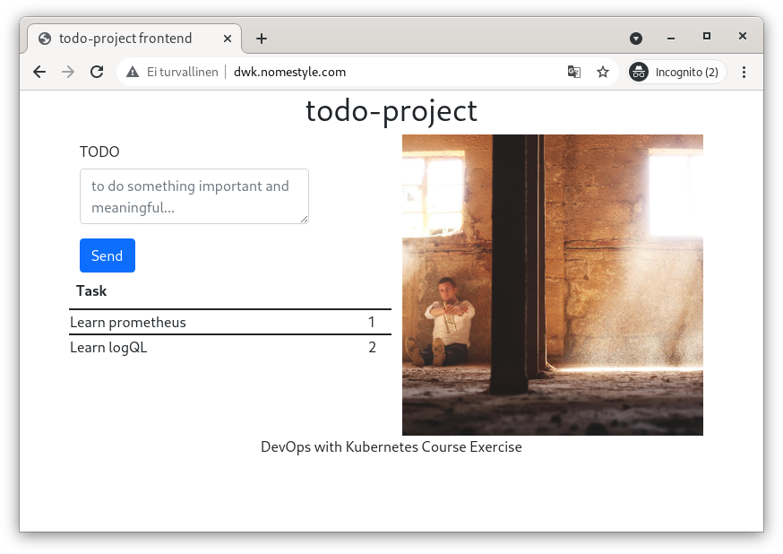

# Exercices

## 4.01

- https://github.com/pasiol/ping-pong/tree/exercise401
- https://github.com/pasiol/log-output/tree/exercise401

pingpong-deployment jää jumiin puuttuneen pvc:n takia (kommentoitu kustomization filessä). Se ajetaan konsolista manuaalisesti alla myöhemmin.

- https://github.com/pasiol/ping-pong/actions/runs/1538870127
- https://github.com/pasiol/log-output/actions/runs/1539176462

console:

    kubectl config set-context --current --namespace=exercise401

    kubectl get pods

    NAME                                  READY   STATUS    RESTARTS   AGE
    log-output-dep-dfc6d5945-bwtpq        1/2     Running   0          4m21s
    ping-pong-799b5868b5-27srr            0/1     Running   0          10m
    ping-pong-postgres-5ff5f79966-9ptz5   0/1     Pending   0          10m

    kubectl apply -f tmp/pvc.yaml
    persistentvolumeclaim/pingpong-pvc created

    kubectl get pods

    NAME                                  READY   STATUS    RESTARTS   AGE
    log-output-dep-dfc6d5945-bwtpq        1/2     Running   0          5m9s
    ping-pong-799b5868b5-27srr            0/1     Running   0          11m
    ping-pong-postgres-5ff5f79966-9ptz5   0/1     Pending   0          11m

    kubectl get pods

    NAME                                  READY   STATUS    RESTARTS   AGE
    log-output-dep-dfc6d5945-bwtpq        1/2     Running   0          5m33s
    ping-pong-799b5868b5-27srr            0/1     Running   0          11m
    ping-pong-postgres-5ff5f79966-9ptz5   1/1     Running   0          11m

    kubectl get pods
    NAME                                  READY   STATUS              RESTARTS      AGE
    log-output-dep-dfc6d5945-bwtpq        1/2     Running             0             6m10s
    ping-pong-799b5868b5-27srr            1/1     Running             1 (25s ago)   12m
    ping-pong-799b5868b5-6znr8            0/1     ContainerCreating   0             1s
    ping-pong-postgres-5ff5f79966-9ptz5   1/1     Running             0             12m

    kubectl get pods

    NAME                                  READY   STATUS    RESTARTS      AGE
    log-output-dep-dfc6d5945-bwtpq        2/2     Running   0             6m43s
    ping-pong-799b5868b5-27srr            1/1     Running   1 (58s ago)   12m
    ping-pong-799b5868b5-6znr8            1/1     Running   0             34s
    ping-pong-postgres-5ff5f79966-9ptz5   1/1     Running   0             12m

    kubectl get ing

    NAME                   CLASS    HOSTS   ADDRESS        PORTS   AGE
    applications-ingress   <none>   *       34.96.64.155   80      7m51s

    curl http://34.96.64.155/health
    {"message":"ok"}

    curl http://34.96.64.155/

    <pre>Hello
    2021-12-04T15:45:19.491421667Z c8c5e457-9d1a-4292-a44a-d09b36256c8c
    Ping / Pongs: 32
    </pre>

    kubectl get svc
    NAME                     TYPE        CLUSTER-IP    EXTERNAL-IP   PORT(S)        AGE
    log-output-svc           NodePort    10.32.1.25    <none>        80:30405/TCP   8m51s
    ping-pong-postgres-svc   ClusterIP   10.32.1.255   <none>        5432/TCP       14m
    ping-pong-svc            ClusterIP   10.32.14.24   <none>        80/TCP         14m

    kubectl apply -f tmp/toolbox.yaml
    pod/toolbox created

    kubectl exec toolbox -- curl http://10.32.14.24/health

    {"message":"ok"}

    kubectl exec toolbox -- curl http://10.32.14.24/pingpong

    Ping / Pongs: 60

## 5.02

- https://github.com/pasiol/todo-project-backend/actions/runs/1539814833
- https://github.com/pasiol/todo-project-backend/tree/exercise402
- https://github.com/pasiol/todo-project/actions/runs/1540901463
- https://github.com/pasiol/todo-project/tree/exercise402

Backend's pvc is commented out. So it won't start.

Console

    kubectl get pods
    NAME                                       READY   STATUS              RESTARTS   AGE
    todo-project-backend-85bfdb8786-6x8sj      0/1     ContainerCreating   0          68s
    todo-project-backend-db-6447c64bf4-dt8qv   0/1     Pending             0          68s

    curl https://raw.githubusercontent.com/pasiol/todo-project-backend/main/manifests/persistentVolumeClaim.yaml > tmp/pvc.yaml

    vim tmp/pvc.yaml
    cat tmp/pvc.yaml

    kind: PersistentVolumeClaim
    apiVersion: v1
    metadata:
      name: todo-project-backend-pvc
    spec:
      accessModes:
        - ReadWriteOnce
      resources:
        requests:
          storage: 100Mi

    kubectl get pods

    NAME                                       READY   STATUS    RESTARTS   AGE
    todo-project-backend-85bfdb8786-6x8sj      0/1     Running   0          3m15s
    todo-project-backend-db-6447c64bf4-dt8qv   0/1     Pending   0          3m15s
    todo-project-frontend-5b74b89877-f8lpw     0/1     Running   0          95s

    kubectl apply -f tmp/pvc.yaml
    persistentvolumeclaim/todo-project-backend-pvc created

    kubectl get pods

    NAME                                       READY   STATUS    RESTARTS   AGE
    todo-project-backend-85bfdb8786-6x8sj      0/1     Running   0          4m15s
    todo-project-backend-db-6447c64bf4-dt8qv   1/1     Running   0          4m15s
    todo-project-frontend-5b74b89877-f8lpw     0/1     Running   0          2m35s

    kubectl get pods

    NAME                                       READY   STATUS    RESTARTS   AGE
    todo-project-backend-85bfdb8786-6x8sj      1/1     Running   0          4m47s
    todo-project-backend-db-6447c64bf4-dt8qv   1/1     Running   0          4m47s
    todo-project-frontend-5b74b89877-f8lpw     0/1     Running   0          3m7s

    kubectl get svc

    NAME                          TYPE           CLUSTER-IP    EXTERNAL-IP    PORT(S)          AGE
    todo-project-backend-db-svc   ClusterIP      10.32.5.87    <none>         5432/TCP         6m20s
    todo-project-backend-svc      LoadBalancer   10.32.2.103   34.88.105.91   8888:31540/TCP   6m20s
    todo-project-frontend-svc     LoadBalancer   10.32.0.46    34.88.203.80   80:31922/TCP     4m40s

There was misconfiguration in the frontend deployment. It won't start before readiness probe is working.

Patched

    kubectl get pods

    NAME                                       READY   STATUS    RESTARTS   AGE
    todo-project-backend-85bfdb8786-6x8sj      1/1     Running   0          6m47s
    todo-project-backend-db-6447c64bf4-dt8qv   1/1     Running   0          6m47s
    todo-project-frontend-5b74b89877-f8lpw     0/1     Running   0          5m7s

    kubectl get pods

    NAME                                       READY   STATUS    RESTARTS   AGE
    todo-project-backend-85bfdb8786-6x8sj      1/1     Running   0          21m
    todo-project-backend-db-6447c64bf4-dt8qv   1/1     Running   0          21m
    todo-project-frontend-75855d566b-6gvd7     1/1     Running   0          9m13s

    curl http://api.nomestyle.com:8888/health
    {"message":"ok"}
    curl http://34.88.203.80/health
    <pre>ok</pre>

Is the memory limit is tight? Or is the app leaking to memory?

## 5.03

    count(kube_pod_info{created_by_kind="StatefulSet",namespace="prometheus"})

Removing namespace the loki-stack and forwarding to the prometheus from prometheus port 9090 to localhost:9090.

    kubectl delete ns loki-stack
    kubectl -n prometheus port-forward prometheus-kube-prometheus-stack-1638-prometheus-0 9090:9090
    firefox http://localhost:9090

## 5.04

## 5.05

https://gorm.io/docs/migration.html

Backend

- https://github.com/pasiol/todo-project-backend/actions/runs/1541624440
- https://github.com/pasiol/todo-project-backend/tree/exercise405

Frontend

- https://github.com/pasiol/todo-project/actions/runs/1541519584
- https://github.com/pasiol/todo-project/tree/exercise405
- https://github.com/pasiol/to-do-project-frontend

    kubectl config set-context --current --namespace=exercise405

    kubectl get deployment

    NAME                      READY   UP-TO-DATE   AVAILABLE   AGE
    todo-project-backend      1/1     1            1           145m
    todo-project-backend-db   1/1     1            1           145m
    todo-project-frontend     1/1     1            1           145m

    kubectl get pods

    NAME                                       READY   STATUS    RESTARTS      AGE
    todo-project-backend-85686bf8-jl5js        1/1     Running   0             86m
    todo-project-backend-db-6447c64bf4-qztjw   1/1     Running   0             145m
    todo-project-frontend-6dcd466465-dmg2c     1/1     Running   2 (61m ago)   145m

    kubectl get svc

    NAME                          TYPE           CLUSTER-IP     EXTERNAL-IP      PORT(S)          AGE
    todo-project-backend-db-svc   ClusterIP      10.32.15.218   <none>           5432/TCP         145m
    todo-project-backend-svc      LoadBalancer   10.32.4.241    35.228.26.89     8888:31572/TCP   145m
    todo-project-frontend-svc     LoadBalancer   10.32.2.238    35.228.215.149   80:31832/TCP     145m

    curl http://api.nomestyle.com:8888/todos
    [{"id":1,"task":"Learn prometheus","done":false},{"id":2,"task":"Learn logQL","done":false},{"id":3,"task":"Learn Gorm","done":false}]

    curl -H "Content-Type: application/json" --request PUT http://api.nomestyle.com:8888/todos/3
    3

    curl http://api.nomestyle.com:8888/todos
    [{"id":1,"task":"Learn prometheus","done":false},{"id":2,"task":"Learn logQL","done":false}]

