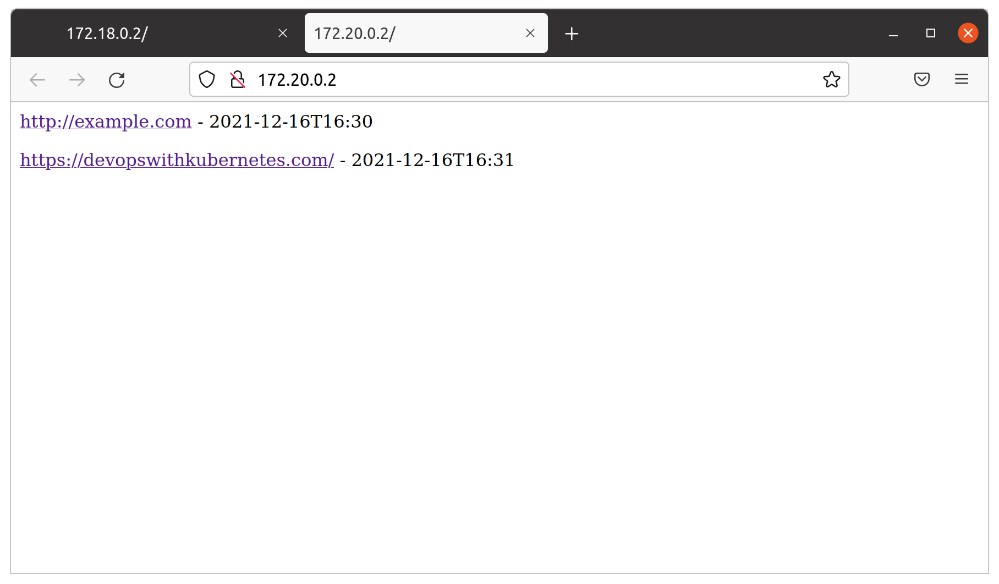
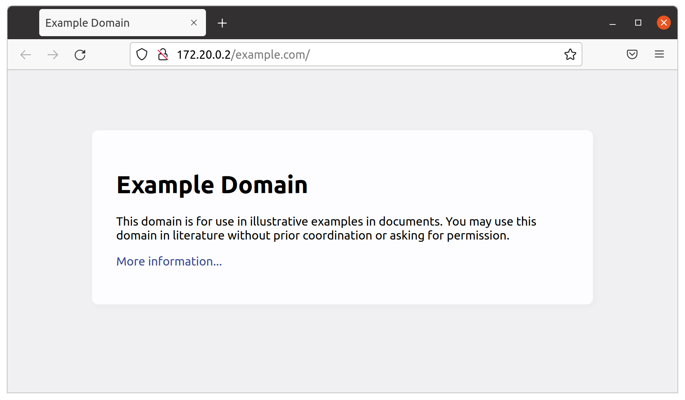
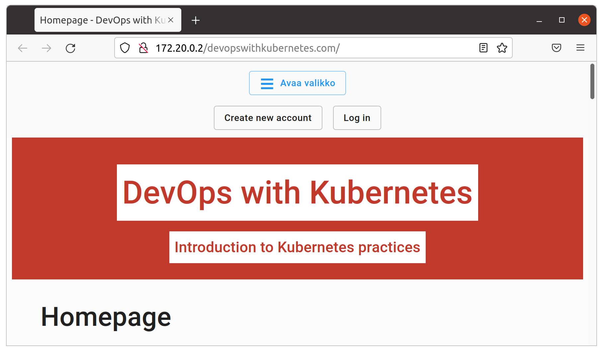
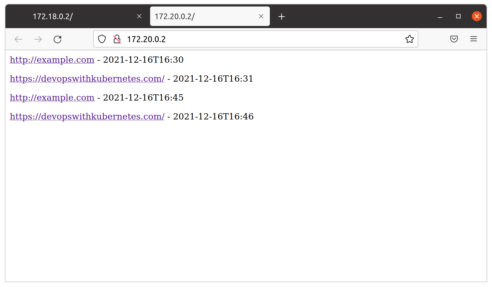
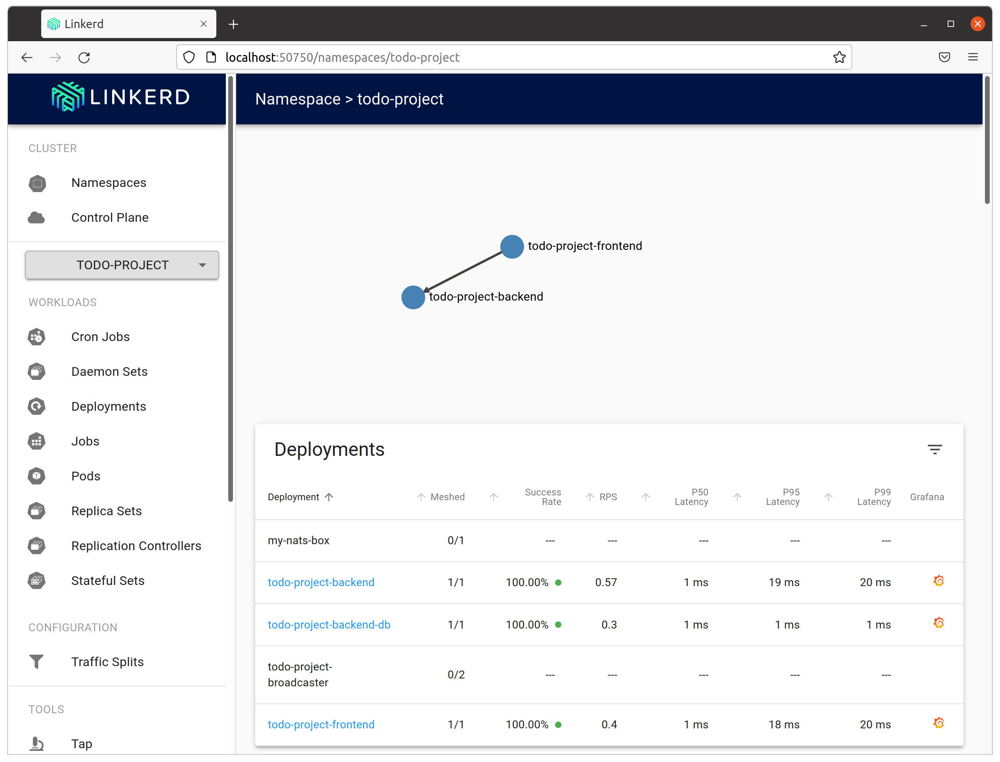
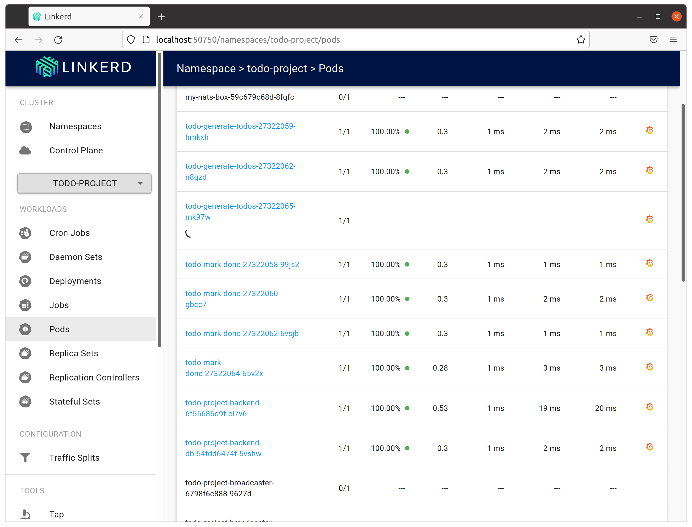
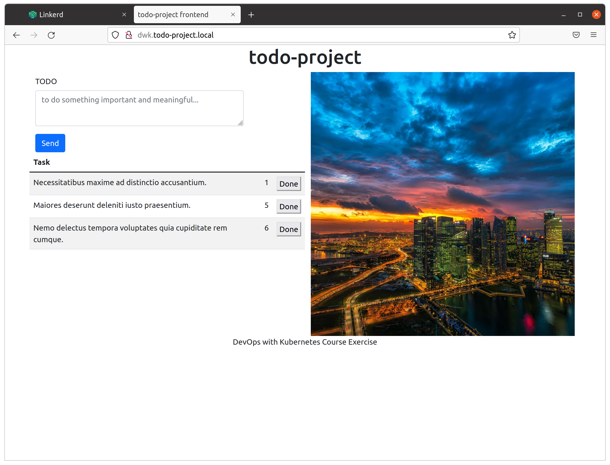
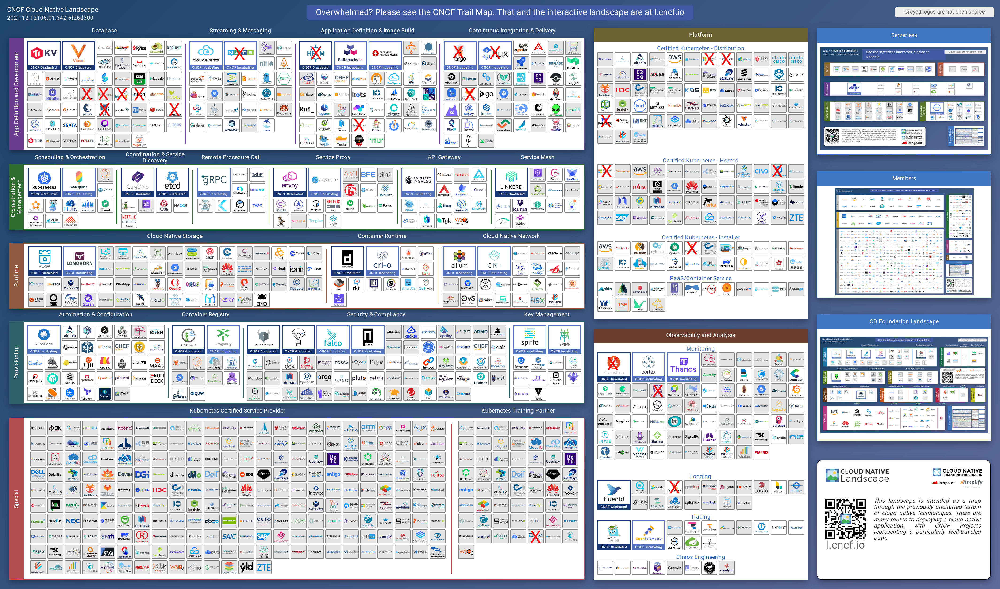

# Exercices

- https://go.kubebuilder.io/quick-start.html
- goquery
- https://www.velotio.com/engineering-blog/extending-kubernetes-apis-with-custom-resource-definitions-crds

## 5.01

Cronjob controller:

I did a golang version of the controller at first, but I didn't get the batch / job to work with persistent volume. To save time, I wrote the controller in Python (dummysite_scraper) for cronjob jobs.

- https://github.com/pasiol/dummysite-controller (jobs)

dummysite_scraper:

- Retrieves dummysite objects from CRD-api. Retrieves a webpage based on the website_url variable. Saves the page to persistent volume. Finally, update the succeed field of the spec object to true.

- https://github.com/pasiol/dummysite_scraper

        kubectl apply -f manifests/stable.dwk.stable.dwk_dummysites.yaml
        customresourcedefinition.apiextensions.k8s.io/dummysites.stable.dwk.stable.dwk created

        kubectl apply -f manifests/permissions.yaml
        serviceaccount/dummysite-controller-account created

        clusterrole.rbac.authorization.k8s.io/dummysite-controller-role created
        clusterrolebinding.rbac.authorization.k8s.io/dummysite-rolebinding created

        kubectl apply -f manifests/dummySites.yaml
        dummysite.stable.dwk.stable.dwk/example-com created
        dummysite.stable.dwk.stable.dwk/dwk created

        kubectl get dummysites
        NAME          AGE
        example-com   13s
        dwk           13s

        kubectl apply -f manifests/volumes.yaml
        persistentvolume/dummysites-pv created
        persistentvolumeclaim/dummysites-pvc created

        kubectl apply -f manifests/cronjob.yaml
        cronjob.batch/dummysite-scraper created

        kubectl logs dummysite-scraper-27327870-wvwpl
        ...
        2021-12-16 16:30:46,964 - __main__ - INFO - created and updated
        2021-12-16 16:31:47,034 - __main__ - INFO - patching dummysite object: {'apiVersion': 'stable.dwk.stable.dwk/v1', 'kind': 'DummySite', 'metadata': {'annotations': {'kubectl.kubernetes.io/last-applied-configuration': '{"apiVersion":"stable.dwk.stable.dwk/v1","kind":"DummySite","metadata":{"annotations":{},"name":"example-com","namespace":"default"},"spec":{"name":"example-com","succeed":false,"website_url":"http://example.com"}}\n'}, 'creationTimestamp': '2021-12-16T16:26:03Z', 'generation': 2, 'managedFields': [{'apiVersion': 'stable.dwk.stable.dwk/v1', 'fieldsType': 'FieldsV1', 'fieldsV1': {'f:metadata': {'f:annotations': {'.': {}, 'f:kubectl.kubernetes.io/last-applied-configuration': {}}}, 'f:spec': {'.': {}, 'f:name': {}, 'f:website_url': {}}}, 'manager': 'kubectl-client-side-apply', 'operation': 'Update', 'time': '2021-12-16T16:26:03Z'}, {'apiVersion': 'stable.dwk.stable.dwk/v1', 'fieldsType': 'FieldsV1', 'fieldsV1': {'f:spec': {'f:succeed': {}}}, 'manager': 'OpenAPI-Generator', 'operation': 'Update', 'time': '2021-12-16T16:31:47Z'}], 'name': 'example-com', 'namespace': 'default', 'resourceVersion': '1086', 'uid': '61649fc4-f5e9-4cdc-9271-eca88f16a3d6'}, 'spec': {'name': 'example-com', 'succeed': True, 'website_url': 'http://example.com'}}
        2021-12-16 16:31:47,274 - __main__ - INFO - text version of dummysite https://devopswithkubernetes.com/:
        ...

        kubectl get jobs
        NAME                             COMPLETIONS   DURATION   AGE
        dummysite-scraper-manual-4mkz0   1/1           48s        14m
        dummysite-scraper-27327810       1/1           5s         10m
        dummysite-scraper-27327820       1/1           2s         12s

---

Web server for scraped dummysites:

Golang is an online service that displays dummysite pages. The pages are stored in Persian volume.

- https://github.com/pasiol/static-server4dummysite

        kubectl apply -f manifests/deployment.yaml
        deployment.apps/static-server4dummysites-dep created
        kubectl apply -f manifests/service.yaml
        service/static-server4dummysites-svc created
        kubectl apply -f manifests/ingress.yaml
        ingress.networking.k8s.io/static-server4dummysites-ingress created

        kubectl get svc
        NAME                           TYPE        CLUSTER-IP     EXTERNAL-IP   PORT(S)   AGE
        kubernetes                     ClusterIP   10.43.0.1      <none>        443/TCP   11m
        static-server4dummysites-svc   ClusterIP   10.43.40.160   <none>        80/TCP    14s

        kubectl get ing
        NAME                               CLASS    HOSTS   ADDRESS                 PORTS   AGE
        static-server4dummysites-ingress   <none>   *       172.20.0.2,172.20.0.3   80      12s

        kubectl get deployment
        NAME                           READY   UP-TO-DATE   AVAILABLE   AGE
        echo                           1/1     1            1           9m43s
        static-server4dummysites-dep   1/1     1            1           55s

        firefox http://172.20.0.2

        kubectl apply -f manifests/dummySites.yaml
        dummysite.stable.dwk.stable.dwk/example-com configured
        dummysite.stable.dwk.stable.dwk/dwk configured

Scraper keeps 60 seconds pause after scraping.

        kubectl get jobs
        NAME                         COMPLETIONS   DURATION   AGE
        dummysite-scraper-27327875   1/1           2s         12m
        dummysite-scraper-27327880   1/1           2s         7m8s
        dummysite-scraper-27327885   1/1           2m3s       2m8s

        firefox http://172.20.0.2

## 5.02

- https://linkerd.io/2.11/tasks/adding-your-service/
- https://github.com/linkerd/linkerd2/issues/1715
- https://github.com/linkerd/linkerd2/issues/4938

I did't succeeded to get NATS working with linkerd despite following options. Without linkerd injection NATS working fine.

https://github.com/pasiol/subscriber-bot/tree/5.02

---

    kubectl get deploy -o yaml | linkerd inject --opaque-ports=4222,8222 --skip-inbound-ports=4222,8222 - | kubectl apply -f -

---

        k3d cluster delete

        k3d cluster create --port 8082:20080@agent:0 -p 8081:80@loadbalancer --agents 6 && docker exec k3d-k3s-default-agent-0 mkdir -p /tmp/kube && docker exec k3d-k3s-default-agent-1 mkdir -p /tmp/kube && docker exec k3d-k3s-default-agent-2 mkdir -p /tmp/kube && docker exec k3d-k3s-default-agent-3 mkdir -p /tmp/kube && docker exec k3d-k3s-default-agent-4 mkdir -p /tmp/kube && docker exec k3d-k3s-default-agent-5 mkdir -p /tmp/kube

---

        linkerd install | kubectl apply -f -

        linkerd viz check
        linkerd-viz
        -----------
        × linkerd-viz Namespace exists
            namespace "viz" not found
            see https://linkerd.io/2.11/checks/#l5d-viz-ns-exists for hints

        Status check results are ×

        linkerd viz install | kubectl apply -f -

----

        kubectl create namespace todo-project
        namespace/todo-project created

        kubectl config set-context --current --namespace todo-project
        Context "k3d-k3s-default" modified.

        helm install my-nats nats/nats

        kubectl get deployment
        NAME          READY   UP-TO-DATE   AVAILABLE   AGE
        my-nats-box   1/1     1            1           14s

---

Backend:

- https://github.com/pasiol/todo-project-backend/tree/5.02

        sops -d manifests/secret.enc.yaml > manifests/secret.yaml
        kubectl apply -f manifests/secret.yaml
        secret/postgres created

        printf "$(cat manifests/db/deployment.yaml | linkerd inject -)" - > manifests/db/deployment.yaml
        deployment "todo-project-backend-db" injected

        printf "$(cat manifests/deployment.yaml | linkerd inject -)" - > manifests/deployment.yaml
        deployment "todo-project-backend" injected

        kubectl apply -k .
        configmap/todo-db-host created
        secret/postgres unchanged
        service/todo-project-backend-db-svc created
        service/todo-project-backend-svc created
        persistentvolume/todo-project-backend-pv created
        persistentvolumeclaim/todo-project-backend-pvc created
        deployment.apps/todo-project-backend created
        deployment.apps/todo-project-backend-db created
        ingress.networking.k8s.io/todo-project-backend-ingress created

        kubectl get deployments
        NAME                      READY   UP-TO-DATE   AVAILABLE   AGE
        my-nats-box               1/1     1            1           4m8s
        todo-project-backend      0/1     1            0           28s
        todo-project-backend-db   1/1     1            1           28s
        kubectl get deployments
        NAME                      READY   UP-TO-DATE   AVAILABLE   AGE
        my-nats-box               1/1     1            1           4m24s
        todo-project-backend-db   1/1     1            1           44s
        todo-project-backend      1/1     1            1           44s

        kubectl get svc
        NAME                          TYPE        CLUSTER-IP    EXTERNAL-IP   PORT(S)                                                 AGE
        my-nats                       ClusterIP   None          <none>        4222/TCP,6222/TCP,8222/TCP,7777/TCP,7422/TCP,7522/TCP   4m44s
        todo-project-backend-db-svc   ClusterIP   10.43.44.56   <none>        5432/TCP                                                64s
        todo-project-backend-svc      ClusterIP   10.43.241.3   <none>        8888/TCP                                                64s

---

Skip this:

Brodcaster:

        sops -d manifests/secretBroadcaster.enc.yaml > manifests/secretBroadcaster.yaml
        kubectl apply -f manifests/secretBroadcaster.yaml
        secret/broadcaster created

        printf "$(cat manifests/deployment.yaml | linkerd inject --skip-inbound-ports=4222,8222 -)" - > manifests/deployment.yaml

        deployment "todo-project-broadcaster" injected

        kubectl apply -f manifests/deployment.yaml
        deployment.apps/todo-project-broadcaster created

---

Frontend:

- https://github.com/pasiol/todo-project/tree/5.02

        printf "$(cat manifests/deployment.yaml | linkerd inject -)" - > manifests/deployment.yaml

        deployment "todo-project-frontend" injected

        kubectl apply -k .

---

Test-data (patched version):

- https://github.com/pasiol/todo-test-data/tree/5.02

        kubectl apply -f manifests/cronjobGenerateTodos.yaml
        cronjob.batch/todo-generate-todos created
        kubectl apply -f manifests/cronjobMarkDone.yaml
        cronjob.batch/todo-mark-done created

        kubectl apply -f manifests/cronjobGenerateTodos.yaml
        cronjob.batch/todo-generate-todos created
        kubectl apply -f manifests/cronjobMarkDone.yaml
        cronjob.batch/todo-mark-done created

---

linkerd viz dashboard

## 5.03

In canary deployment kubectl-command was used to make update.

        kubectl -n test set image deployment/podinfo \
        podinfod=quay.io/stefanprodan/podinfo:1.7.1

## 5.04

- https://github.com/pasiol/ping-pong/tree/5.05 (typo in branch name)

    kubectl apply -f manifests/service.yaml
    service.serving.knative.dev/ping-pong-serverless created

    kubectl get svc
    NAME                                 TYPE        CLUSTER-IP     EXTERNAL-IP   PORT(S)                                      AGE
    ping-pong-postgres-svc               ClusterIP   10.43.17.171   <none>        5432/TCP                                     7m49s
    ping-pong-serverless-00001-private   ClusterIP   10.43.142.12   <none>        80/TCP,9090/TCP,9091/TCP,8022/TCP,8012/TCP   4s
    ping-pong-serverless-00001           ClusterIP   10.43.20.107   <none>        80/TCP                                       4s

    kubectl get ksvc
    NAME                   URL                                                    LATESTCREATED                LATESTREADY   READY     REASON
    ping-pong-serverless   http://ping-pong-serverless.applications.example.com   ping-pong-serverless-00001                 Unknown   RevisionMissing

    kubectl get pods
    NAME                                                    READY   STATUS    RESTARTS   AGE
    ping-pong-postgres-65b7988b74-cx67f                     1/1     Running   0          8m9s
    ping-pong-serverless-00001-deployment-6cc96d85d-9mq9m   2/2     Running   0          17s

    kubectl get ksvc
    NAME                   URL                                                    LATESTCREATED                LATESTREADY                  READY   REASON
    ping-pong-serverless   http://ping-pong-serverless.applications.example.com   ping-pong-serverless-00001   ping-pong-serverless-00001   True    
    kubectl get routes
    NAME                   URL                                                    READY   REASON

    ping-pong-serverless   http://ping-pong-serverless.applications.example.com   True    
    curl -H "Host: ping-pong-serverless.applications.example.com" http://localhost:8083
    Ping / Pongs: 1
    curl -H "Host: ping-pong-serverless.applications.example.com" http://localhost:8083
    Ping / Pongs: 2
    curl -H "Host: ping-pong-serverless.applications.example.com" http://localhost:8083
    Ping / Pongs: 3

    kubectl logs ping-pong-serverless-00001-deployment-6cc96d85d-9mq9m
    error: a container name must be specified for pod ping-pong-serverless-00001-deployment-6cc96d85d-9mq9m, choose one of: [user-container queue-proxy]
    kubectl logs ping-pong-serverless-00001-deployment-6cc96d85d-9mq9m user-container
    2021/12/13 19:31:26 Reading environment failed.
    2021/12/13 19:31:27 counter is 0
    2021/12/13 19:31:27 starting pingpong server in 0.0.0.0:8080.
    2021/12/13 19:31:27 Version:  , build:
    2021/12/13 19:31:27 Allowed origins:
    2021/12/13 19:32:31 written 16 bytes address 127.0.0.1:43042: Ping / Pongs: 1
    2021/12/13 19:32:33 written 16 bytes address 127.0.0.1:43042: Ping / Pongs: 2
    2021/12/13 19:32:34 written 16 bytes address 127.0.0.1:43042: Ping / Pongs: 3

    kubectl logs ping-pong-serverless-00001-deployment-6cc96d85d-9mq9m queue-proxy
    {"severity":"INFO","timestamp":"2021-12-13T19:31:31.53418258Z","caller":"logging/config.go:116","message":"Successfully created the logger."}
    {"severity":"INFO","timestamp":"2021-12-13T19:31:31.534255375Z","caller":"logging/config.go:117","message":"Logging level set to: info"}
    {"level":"info","ts":1639423891.5346577,"logger":"fallback","caller":"metrics/metrics_worker.go:76","msg":"Flushing the existing exporter before setting up the new exporter."}
    {"level":"info","ts":1639423891.5347958,"logger":"fallback","caller":"metrics/prometheus_exporter.go:51","msg":"Created Prometheus exporter with config: &{knative.dev/internal/serving revision prometheus 5000000000 <nil> <nil>  false 9091 0.0.0.0}. Start the server for Prometheus exporter."}
    {"level":"info","ts":1639423891.5348158,"logger":"fallback","caller":"metrics/metrics_worker.go:91","msg":"Successfully updated the metrics exporter; old config: <nil>; new config &{knative.dev/internal/serving revision prometheus 5000000000 <nil> <nil>  false 9091 0.0.0.0}"}
    {"severity":"INFO","timestamp":"2021-12-13T19:33:35.302462798Z","logger":"queueproxy","caller":"queue/main.go:382","message":"Attached drain handler from user-container","commit":"f1e419a","knative.dev/key":"applications/ping-pong-serverless-00001","knative.dev/pod":"ping-pong-serverless-00001-deployment-6cc96d85d-9mq9m"}
    {"severity":"INFO","timestamp":"2021-12-13T19:33:35.311465586Z","logger":"queueproxy","caller":"queue/main.go:227","message":"Received TERM signal, attempting to gracefully shutdown servers.","commit":"f1e419a","knative.dev/key":"applications/ping-pong-serverless-00001","knative.dev/pod":"ping-pong-serverless-00001-deployment-6cc96d85d-9mq9m"}
    {"severity":"INFO","timestamp":"2021-12-13T19:33:35.311542805Z","logger":"queueproxy","caller":"queue/main.go:229","message":"Sleeping 30s to allow K8s propagation of non-ready state","commit":"f1e419a","knative.dev/key":"applications/ping-pong-serverless-00001","knative.dev/pod":"ping-pong-serverless-00001-deployment-6cc96d85d-9mq9m"}

## 5.05

## 5.06

